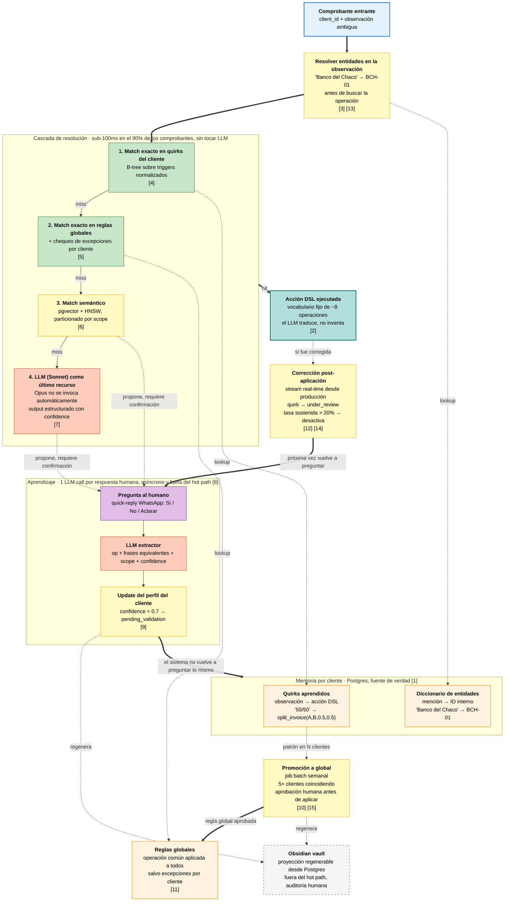

# Second Brain · Submission · Agustina Gomez

> El agente no necesita recordar más texto. Necesita aprender mejores traducciones entre
> lenguaje humano, contexto de cliente y acciones verificables.

---

## El reframe

La lectura obvia del problema es "el agente tiene que recordar qué significa cada
observación". Embeddings, retrieval, prompt injection. Funciona en demo y se cae a los dos meses.

Yo lo doy vuelta así: las observaciones son infinitas, pero las acciones que el sistema puede
ejecutar son una decena. "Hacer 50/50", "factura A y B" y "una A y una B" son tres frases
distintas que disparan la misma acción. Lo que el sistema aprende es esa traducción, no el
string que la gatilló.

De ahí salen dos decisiones:

1. **La unidad de memoria es el cliente, no la observación.** Cada cliente recurrente tiene un
   perfil; el sistema consulta el perfil del cliente que mandó este comprobante, no una base
   global de strings parecidos. Un humano que opera esto piensa en clientes, no en mensajes.

2. **El perfil acumula dos tipos de memoria.** Operaciones: observación a qué hacer (`"50/50"`
   se traduce a `split_invoice(A, B, 0.5, 0.5)`). Entidades: mención a ID interno (`"Banco del
   Chaco"` se resuelve a `bank_id: BCH-01`). Aparecen mezcladas en las observaciones reales:
   "transferencia de Banco del Chaco, hacer 50/50" necesita primero resolver una entidad y
   después aplicar una operación. Modelar uno solo deja la mitad del problema sin resolver.

---

## Cómo funciona

Cuando llega un comprobante con observación ambigua, el sistema pasa por una cascada. Verde es sub-100ms sin LLM, amarillo es sub-segundo con embeddings, naranja es LLM (solo aparece en miss), gris es Obsidian fuera del hot path. Los números entre corchetes referencian la documentación de la submission (ver tabla debajo del diagrama).

<b>Referencias del diagrama</b>

| | Archivo | Líneas | Qué muestra |
|---|---|---|---|
| **[1]** | `arquitectura.md` | L10-22 | Perfil del cliente, dos tipos de memoria |
| **[2]** | `arquitectura.md` | L59-83 | La Action DSL, vocabulario fijo |
| **[3]** | `arquitectura.md` | L93-96 | Resolver entidades antes del match de operación |
| **[4]** | `arquitectura.md` | L97-98 | Match exacto en quirks del cliente |
| **[5]** | `arquitectura.md` | L99-100 | Match exacto en reglas globales |
| **[6]** | `arquitectura.md` | L101-102 | Match semántico con pgvector |
| **[7]** | `arquitectura.md` | L103-105 | LLM como último recurso |
| **[8]** | `arquitectura.md` | L116-140 | Aprendizaje, 1 LLM call por respuesta humana |
| **[9]** | `arquitectura.md` | L138-140 | confidence < 0.7 → pending_validation |
| **[10]** | `arquitectura.md` | L144-153 | Promoción a global, aprobación humana |
| **[11]** | `arquitectura.md` | L170 | `global_rules` en el schema |
| **[12]** | `arquitectura.md` | L198-201 | Correction rate, ventana móvil, desactivación al 20% |
| **[13]** | `ejemplos.md` | L67-137 | Caso de entidad + operación combinadas |
| **[14]** | `ejemplos.md` | L139-165 | Caso de corrección |
| **[15]** | `ejemplos.md` | L167-199 | Caso de promoción a global |

Cinco cosas que el diagrama no cuenta y conviene tener a mano. **El sistema no arranca en
frío**: antes del go-live, un job batch corre sobre los últimos 90 días de historial y
pre-puebla perfiles de los 50-100 clientes que cubren el grueso del tráfico. Costo bajo (~US$1
en LLM más revisión humana), y sin esto la primera semana se dispara 30 preguntas/día y el
operador apaga el sistema. Detalle en `decisiones.md` §3. **La sync con Obsidian es
bidireccional pero asimétrica**: un job regenera el vault desde Postgres después de cada
aprendizaje, y las ediciones humanas en el vault vuelven por PR + CI que escribe a Postgres.
Obsidian nunca es fuente de verdad. **El MVP arranca con 6-8 operaciones** en la DSL más un
campo `when` opcional con tres predicados cerrados (`entity ==`, `amount >/<`, `date_in`);
cubre el caso "50/50 normal, 60/40 si viene del depósito Pilar" sin agregar lógica inventada
por el LLM. **El flujo de edits humanas es PR + CI**, suficiente para operadores técnicos. La
UI delgada para operadores contables/operativos está en el roadmap inmediato (ver
`decisiones.md §4.2`), no en el horizonte lejano. **El costo mensual estimado** queda entre
US$5 y US$80 según miss rate y cache hit del prompt (ver tabla de escenarios en
`decisiones.md §7`); cuando el provider de WhatsApp no soporta quick-reply, fallback a texto
plano con parser determinístico.

---

## Aprendizaje y correcciones

Cuando el humano aclara, una llamada al LLM extrae la traducción como JSON: operación, frases
equivalentes, scope sugerido, confidence. Los quirks con confidence bajo entran como
`pending_validation` y no se aplican solos hasta que alguien confirme.

Las correcciones importan tanto como los aciertos. Si una regla aplicada fue corregida, el
quirk pasa a `under_review` y la próxima vez el sistema vuelve a preguntar. Si un quirk acumula
20% de correcciones, se desactiva. Si no se hace así, las reglas malas se quedan adentro hasta
que alguien las saque a mano, y eso va a pasar.

Promover una regla a global siempre necesita aprobación humana: decidir que algo aplica a todos
los clientes tiene consecuencias operativas reales, así que el sistema propone con evidencia y
alguien firma.

---

## Por qué cumple los 3 criterios

**Realismo:** el LLM aparece sólo en miss y aprendizaje, Obsidian queda fuera del runtime, las
correcciones son parte del diseño y los costos van con rango.

**Innovación:** el reframe DSL más perfil de cliente como unidad de memoria hace que las
aclaraciones humanas se compilen a programas ejecutables y auditables en lugar de quedar como
texto inyectado al prompt, y la memoria por cliente captura las dos dimensiones que aparecen
mezcladas en cada observación real (operaciones y entidades).

**Escalabilidad:** tres decisiones explícitas sostienen la promesa, las dejo nombradas porque
son las que se rompen cuando un sistema así crece. **Al LLM va un subset curado del perfil**
(top-K quirks por relevancia semántica al input, no el perfil entero): un cliente maduro con
200+ quirks acumula fácil 30-50k tokens, así que la cota del prompt se calibra, no se asume.
**La búsqueda vectorial se particiona por cohorte de clientes**, no por cliente individual,
para no terminar con 1M de mini-índices HNSW de pocos vectores; el scope "cliente" se filtra
por metadata. **Mientras un quirk está en `under_review`**, los comprobantes que lo peguen
caen a `hold_for_review` y esperan al humano: un ping por quirk pendiente, no uno por
comprobante, así "vuelve a preguntar la próxima vez" no se convierte en DDoS al operador. La
búsqueda exacta sigue siendo O(log n) y el costo no crece linealmente porque la mayoría de
comprobantes ni siquiera tocan el LLM. Y el archivado de quirks, entidades y perfiles sin uso
(6 meses para items, 12 para perfiles enteros) está incluido en el runtime, no es proyecto
futuro: a 1M de clientes con churn natural, asumir crecimiento infinito rompe la promesa.
Detalle en `decisiones.md` §6.

---

## Estructura de esta submission

- [`arquitectura.md`](./arquitectura.md): diseño del MVP, perfil, pipeline, aprendizaje, correcciones, schema esencial.
- [`decisiones.md`](./decisiones.md): alternativas descartadas, posicionamiento frente al espíritu del workshop, horizontes de evolución.
- [`ejemplos.md`](./ejemplos.md): walkthroughs end-to-end concretos y wireframe de la UI de revisión.
