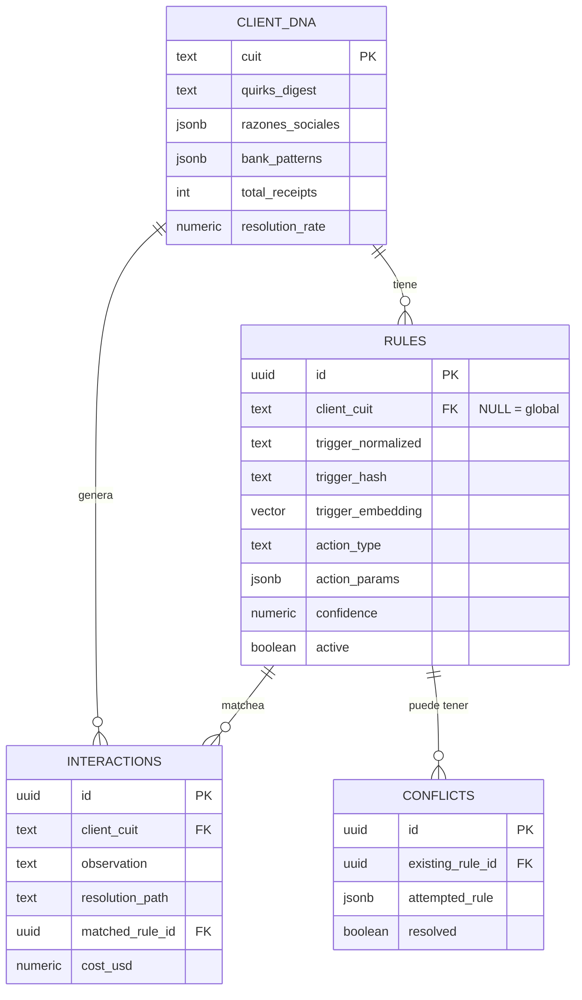
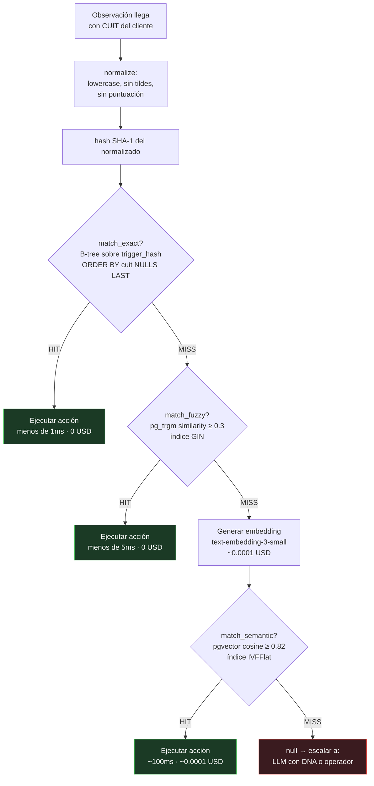
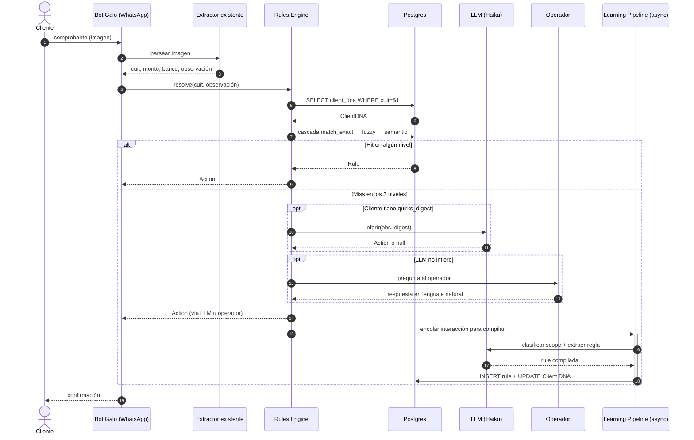
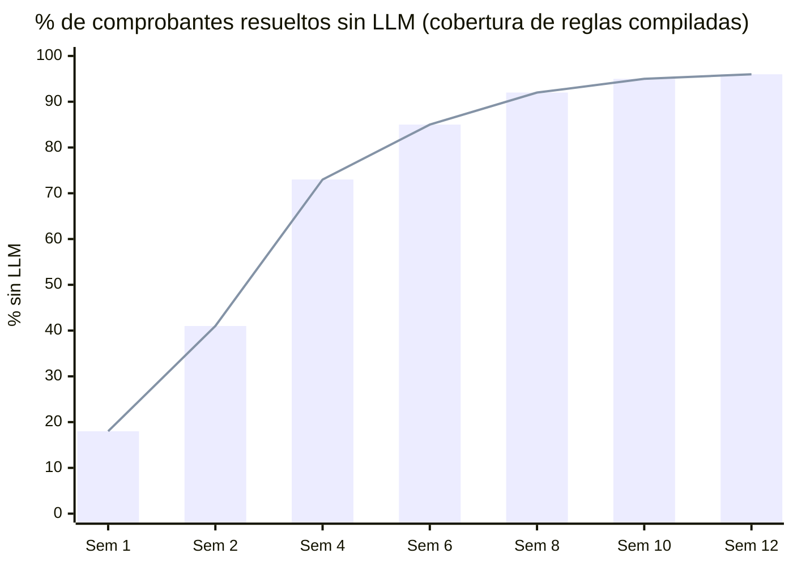
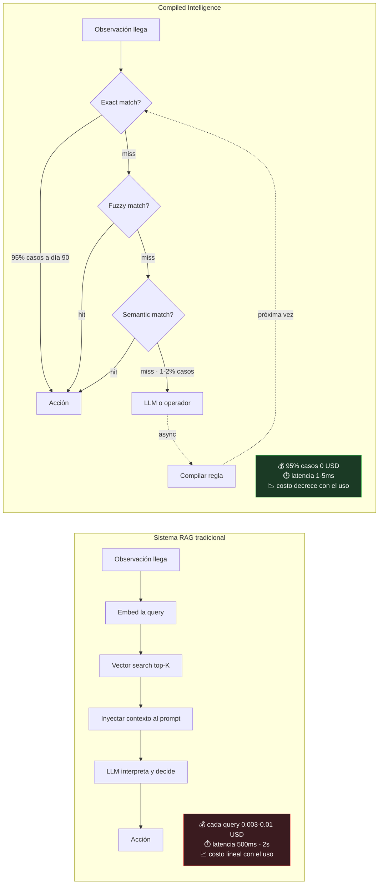
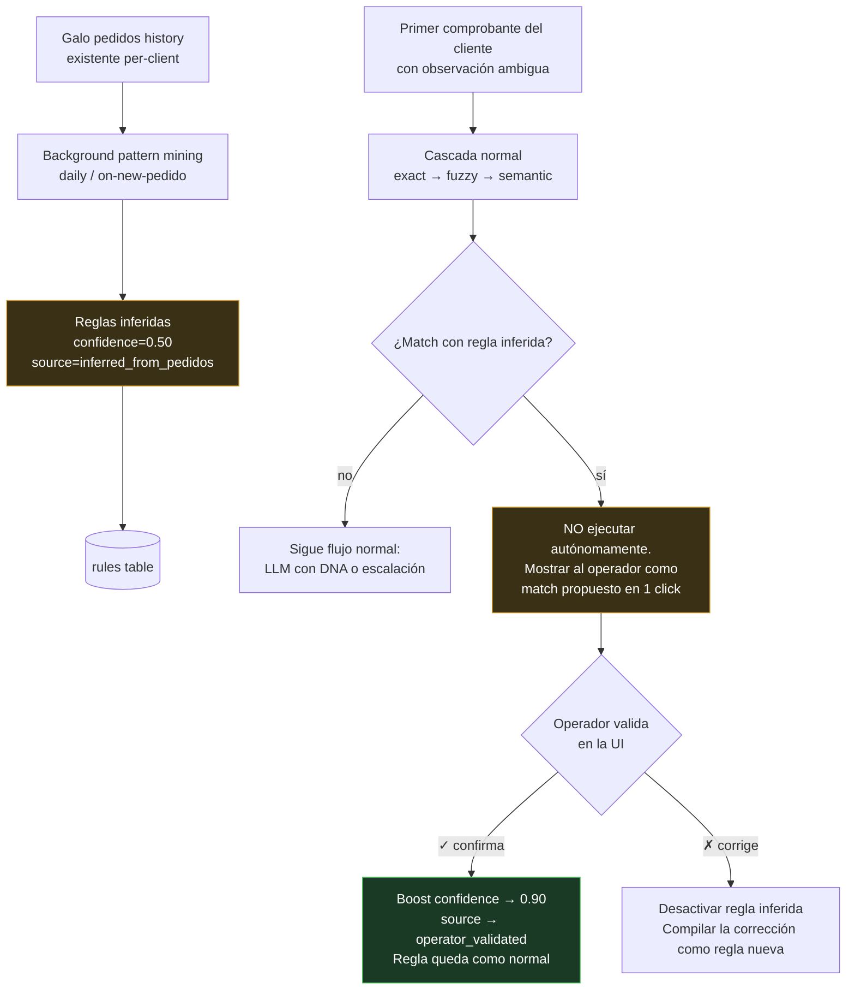
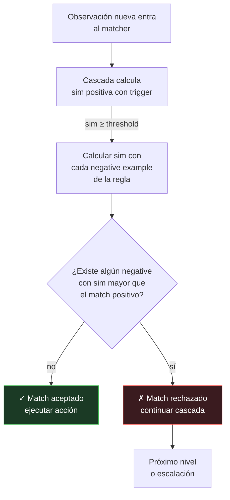

# Compiled Intelligence: arquitectura completa

> Documento de arquitectura para el sistema de memoria del agente de comprobantes de [Galo](https://soygalo.com).
> Submission al [Workshop Challenge](https://github.com/fpesce27/workshop-challenge) por [@Agusting22](https://github.com/Agusting22).

---

## Resumen ejecutivo

Este documento describe el sistema completo en ~700 líneas. Si solo querés entender qué hace este sistema y qué lo diferencia, leé esto:

**El núcleo (§1-§10):** un sistema de memoria que **compila** las aclaraciones del operador en reglas determinísticas, en vez de guardarlas como texto para que un LLM las relea cada vez. La cascada de 3 niveles (exact → fuzzy → semantic) resuelve el 95%+ de los casos sin LLM. *La parte de "compilar respuestas humanas en reglas reutilizables" es la respuesta razonable que cualquier IA propondría a este challenge.*

**Los dos diferenciales (§11 y §12 — lo que un prompt genérico NO propone):**

1. **§11. Pre-compilación predictiva desde el historial de pedidos.** Galo ya tiene el historial de pedidos de cada cliente. Lo minamos para pre-poblar reglas de baja confianza **antes** del primer comprobante. El sistema **no arranca vacío** — arranca con ~30-45% de cobertura el Día 1. Una IA genérica no razona sobre data lateral que la empresa ya tiene.

2. **§12. Aprendizaje negativo / reglas de frontera.** Cada corrección del operador genera **tanto una regla nueva como un contra-ejemplo** de la regla que se equivocó. Las reglas aprenden explícitamente **sus límites**, no solo sus respuestas correctas. Una corrección humana entrega valor en dos dimensiones, no una.

**Cómo verlo en acción sin leer el doc completo:** abrí [`demo.html`](./demo.html) con doble click en cualquier browser. Pickeá uno de los presets, ves la cascada animada. El propio demo tiene un botón **📖 ¿Cómo funciona?** que abre un panel con la explicación visual.

---

## Tabla de contenidos

1. [El problema real](#1-el-problema-real)
2. [La idea: compilar en vez de interpretar](#2-la-idea-compilar-en-vez-de-interpretar)
3. [Los cuatro componentes](#3-los-cuatro-componentes)
4. [Flujo end-to-end de un comprobante](#4-flujo-end-to-end-de-un-comprobante)
5. [Per-client vs global: la doble dimensión](#5-per-client-vs-global-la-doble-dimensi%C3%B3n)
6. [Edge cases y manejo de errores](#6-edge-cases-y-manejo-de-errores)
7. [Costos a escala](#7-costos-a-escala)
8. [Escalabilidad técnica](#8-escalabilidad-t%C3%A9cnica)
9. [Por qué no es RAG](#9-por-qu%C3%A9-no-es-rag)
10. [Decisiones y trade-offs](#10-decisiones-y-trade-offs)
11. [**Diferencial — Pre-compilación predictiva desde pedidos history**](#11-diferencial--pre-compilación-predictiva-desde-el-historial-de-pedidos)
12. [**Diferencial — Aprendizaje negativo / reglas de frontera**](#12-diferencial--aprendizaje-negativo--reglas-de-frontera)

---

## 1. El problema real

El agente actual de Galo procesa correctamente la mecánica de los comprobantes: extrae monto, CBU, CUIT, banco, y ejecuta validaciones. **El problema aparece en el campo de observaciones cuando el cliente escribe instrucciones ambiguas**:

- `armar factura A y B` — el cliente quiere dos facturas pero no dice en qué proporción.
- `hacer 50/50` — ¿dividir el monto? ¿el tipo de factura? ¿entre razones sociales? depende del cliente.
- múltiples razones sociales en la misma nota.
- `sumar IVA aparte` — instrucción fiscal que puede ser de un cliente o general.

El bot actual, ante cualquier ambigüedad, **le pregunta al cliente**. Y acá empieza el problema real:

> Los clientes son **recurrentes** y operan compras semanales o diarias con Galo. Preguntarle a un cliente recurrente "¿qué quisiste decir con 50/50?" **una vez** es aceptable. Preguntárselo cada semana es ofensivo y rompe la relación comercial. El sistema **no puede preguntar dos veces lo mismo al mismo cliente**.

Esto convierte el problema de memoria en **un requerimiento de negocio**, no en una optimización de costo o latencia. La memoria es lo que hace viable el producto.

### Tres fallas encadenadas hoy

1. **Sin memoria persistente** — la conversación con el operador se pierde. La próxima vez el bot vuelve a no saber.
2. **Contexto saturado** — si se intenta inyectar historial conversacional al prompt, se llena de ruido.
3. **Sin distinción client/global** — el sistema no diferencia un quirk de un cliente de un concepto universal.

### Contexto que ya tiene Galo (y que el sistema puede explotar)

Cuando llega un comprobante, Galo **ya sabe**:
- Quién es el cliente (CUIT, razones sociales, banco habitual).
- Qué pidió (historial de pedidos previos).
- Patrones de comportamiento: montos típicos, frecuencia, productos.

Esto significa que el sistema de memoria no arranca vacío: puede pre-popular el perfil de cada cliente con datos existentes y aprender desde ahí.

### Lo que Galo NO hace (y por qué importa)

Galo **no factura** ni hace logística — eso lo maneja el ERP de cada empresa contratante. La "acción" final del sistema es **transmitir una instrucción estructurada al sistema externo**, no ejecutar una operación contable. Esto simplifica el modelo: las acciones son mensajes pasables a un ERP, no operaciones críticas en sí mismas. El error es recuperable porque hay otro sistema downstream que las consume y valida.

---

## 2. La idea: compilar en vez de interpretar

La analogía técnica que guía toda la arquitectura es la diferencia entre **un intérprete y un compilador**.

Un intérprete lee código fuente cada vez que necesita ejecutarlo, lo analiza, decide qué hacer. Es flexible pero lento — repite el mismo trabajo en cada ejecución. Un compilador transforma el código fuente **una sola vez** en instrucciones ejecutables. Después, esas instrucciones corren directamente, sin volver a analizar el fuente.

Los sistemas de memoria basados en RAG son intérpretes: almacenan texto, lo buscan con embeddings, lo inyectan al prompt, y el LLM lo interpreta cada vez que aparece la misma observación. Funciona, pero el costo crece linealmente con el uso.

**Compiled Intelligence es un compilador**: cuando el operador explica qué hacer con una observación, esa respuesta se compila **una vez** en una regla estructurada (trigger + acción + metadata). La próxima vez que aparece esa observación (o una equivalente), la regla se ejecuta directamente. Sin embedding-search, sin prompt, sin LLM.

El LLM queda reservado para dos momentos:

1. **Aprendizaje**: compilar la respuesta del operador en regla (asíncrono, fuera del path crítico).
2. **Casos genuinamente nuevos**: cuando la cascada determinística falla y existe un Client DNA, intentar inferir antes de escalar al operador.

Todo lo demás es determinístico.

---

## 3. Los cuatro componentes

El sistema tiene cuatro componentes que operan en conjunto. El modelo de datos persistente es compacto — cuatro tablas con relaciones bien definidas:



### 3.1 Rules Engine — cascada de matching

Primera línea de procesamiento. Recibe `(cuit, observacion)` y devuelve `Rule | null`. Funciona como un lookup en tres niveles **ordenados de más barato a más caro**. Se corta en el primer match.

**Nivel 1 — Exact match (hash).** Se normaliza la observación (lowercase, sin tildes, sin espacios duplicados, sin puntuación redundante) y se calcula un hash SHA-1. Lookup contra índice B-tree sobre `normalized_trigger_hash`. **O(log n), <1ms, costo USD 0.**

> Cubre el caso "el cliente escribe exactamente lo mismo que ya vimos antes" — el más común a régimen.

**Nivel 2 — Fuzzy match (trigramas).** Si no hay exact match, se usa `pg_trgm` de Postgres para buscar por similitud de trigramas con umbral 0.3. Captura variaciones tipográficas: `fact. A y B`, `factura tipo A + B`, `factura A & B` todas matchean contra `armar factura a y b`. Índice GIN. **<5ms, costo USD 0.**

> Cubre el caso "lo escribió distinto pero quiso decir lo mismo".

**Nivel 3 — Semantic match (embeddings).** Si los dos anteriores fallan, se genera embedding de la observación con `text-embedding-3-small` (USD 0.00002/1K tokens) y se busca con similitud coseno >= 0.82 contra embeddings almacenados usando pgvector + IVFFlat. **~100ms, ~USD 0.0001.**

> Cubre el caso "dijo algo completamente distinto pero semánticamente equivalente": "dividir en dos partes iguales" → matchea "50/50".

**Prioridad per-client.** En los tres niveles, las reglas con `client_cuit` igual al del comprobante tienen prioridad sobre las globales (`client_cuit IS NULL`). Se implementa con `ORDER BY client_cuit NULLS LAST` — las per-client aparecen primero, las globales son fallback. Si un cliente tiene su propia regla de "50/50", se aplica esa; si no, la global.

**Estructura de una regla** (ver [`schema.sql`](./schema.sql) y [`types.ts`](./types.ts)):

```typescript
type Rule = {
  id: string;
  client_cuit: string | null;       // null = global
  trigger_text: string;              // texto original
  trigger_normalized: string;        // normalizado
  trigger_hash: string;              // sha1 del normalizado
  trigger_embedding: number[];       // vector(1536)
  action: Action;                    // tipo + params
  confidence: number;                // 0..1
  times_used: number;
  source_interaction_id: string;     // trazabilidad
  created_at: Date;
  active: boolean;
};
```

**Decisión visual de la cascada:**



### 3.2 Client DNA — perfil estructurado por cliente

Un registro **compacto** (no creciente) que representa todo lo que el sistema sabe del cliente. **No es un log** — es una foto compilada del estado actual, diseñada para caber en un prompt sin saturar contexto.

Campos clave:

- **`quirks_digest`** — resumen en lenguaje natural de las reglas activas del cliente, generado por el Learning Pipeline. Ej: *"Siempre factura 50/50 entre tipo A y B. Tiene dos razones sociales: ABC SRL para montos >100.000, XYZ SA para el resto. Los viernes pide IVA como línea separada."* Tope: ~150 tokens. Se recompila cuando hay ≥3 reglas nuevas o cuando una existente cambia.
- **`razones_sociales`** — JSON con las entidades legales del cliente y reglas de selección (por monto, por banco, default).
- **`bank_patterns`** — bancos habituales del cliente. Anomalías (un comprobante de un banco inusual) se loguean.
- **`stats`** — total de comprobantes, tasa de resolución automática, último visto.

Tamaño total acotado: **~200-500 tokens por cliente**, independientemente de cuántos comprobantes haya procesado. La información granular vive en las reglas; el DNA es un resumen ejecutivo para que el LLM tenga contexto cuando lo necesita.

### 3.3 LLM — Haiku como modelo principal, de último recurso

El LLM **no opera el sistema**: enseña al sistema. Solo aparece en dos escenarios:

**Escenario A — Inferencia con DNA.** El Rules Engine no encontró match pero el cliente tiene `quirks_digest` no vacío. Se llama a Haiku con un prompt mínimo: observación + digest + lista cerrada de `action_types`. Si Haiku infiere una acción con alta certeza, se ejecuta y se envía al Learning Pipeline para compilar como regla. ~1-2s, ~USD 0.003.

**Escenario B — Escalación al operador.** Ni el Rules Engine ni la inferencia funcionaron. Se le pregunta al **operador humano** (no al cliente — el cliente nunca vuelve a ser molestado por lo mismo). La pregunta incluye nombre del cliente, monto, observación, y el quirks_digest si existe (para que el operador tenga contexto sin tener que recordar de memoria). Su respuesta se usa para procesar el comprobante actual y se manda al Learning Pipeline.

**Por qué Haiku.** Las tareas son acotadas (clasificación binaria, extracción a JSON, inferencia con contexto chico). No requieren razonamiento de Sonnet u Opus. Haiku es ~20x más barato que Sonnet y latencia significativamente menor.

### 3.4 Learning Pipeline — compilador asíncrono

Transforma respuestas humanas desestructuradas en reglas ejecutables. **Asíncrono** — corre después de que el comprobante ya fue procesado, sin agregar latencia al flujo principal.

Seis pasos (detalle en [`learning-pipeline.ts`](./learning-pipeline.ts)):

1. **Clasificar scope (per-client vs global).** Heurísticas primero ("este cliente", "él siempre" → per-client; "en general", "siempre que diga X" → global). Si no es concluyente, una llamada a Haiku con prompt binario (~USD 0.0003).
2. **Extraer regla.** Haiku devuelve JSON con `action_type` (de un conjunto cerrado), `action_params`, y un `confidence`. Si no mapea a ningún `action_type` conocido, se usa `custom_instruction` con texto libre. ~USD 0.0005.
3. **Compilar.** Normalizar trigger, generar hash, generar embedding, asignar metadata.
4. **Verificar conflictos.** Si existe una regla con mismo trigger y misma acción, se hace merge (incrementa `times_used`). Si existe con acción distinta, **se marca para revisión** — el sistema no auto-resuelve conflictos porque la consecuencia (transmitir instrucción incorrecta al ERP) es costosa. Conflictos global↔per-client no son conflictos: per-client siempre gana.
5. **Persistir.** INSERT en Postgres con todos los índices actualizados.
6. **Actualizar Client DNA.** Recompilar `quirks_digest` si acumuló ≥3 reglas nuevas. Una llamada a Haiku (~USD 0.001), unas pocas veces por semana por cliente.

Costo total del pipeline por aprendizaje: ~USD 0.001-0.002. A 10 aprendizajes nuevos por día (decreciente con el tiempo), USD 0.01-0.02/día. Despreciable.

---

## 4. Flujo end-to-end de un comprobante

El intercambio entre los componentes en una sola toma:



Ver también [`flow.mmd`](./flow.mmd) para un diagrama de flujo alternativo. Resumen narrativo:

**Momento 0.** Llega imagen del comprobante por WhatsApp. **(Galo existente)**

**Momento 1.** El agente actual extrae datos estructurados: monto, CBU, CUIT, banco, observación. **(Galo existente, fuera de alcance)**

**Momento 2.** Lookup del cliente por CUIT en `client_dna`. Si no existe, se crea perfil vacío con los datos del comprobante. Operación O(1).

**Momento 3.** Si la observación está vacía o es texto plano sin instrucciones (heurística: solo números, referencias a facturas), se procesa normal sin tocar el sistema de memoria. Si requiere interpretación (verbos imperativos, sustantivos de dominio, patrones numéricos ambiguos), entra al Rules Engine.

**Momento 4 — Rules Engine.** Cascada:
- Exact match (hash) filtrando por `client_cuit` → si hay, ejecutar.
- Fuzzy (pg_trgm) → si hay, ejecutar.
- Semantic (pgvector) → si hay, ejecutar.

Las tres queries priorizan `client_cuit` específico sobre `NULL` (global) con `ORDER BY client_cuit NULLS LAST`.

**Momento 5a — Inferencia con DNA** (solo si la cascada falló y el cliente tiene `quirks_digest`). Llamada a Haiku con observación + digest. Si Haiku infiere con confianza, ejecutar y mandar al Learning Pipeline.

**Momento 5b — Escalación al operador** (si todo lo anterior falló). Mensaje al operador con contexto mínimo. Respuesta del operador → procesar comprobante + Learning Pipeline.

**Momento 6 — Ejecutar acción.** Transmitir la instrucción estructurada al ERP downstream de la empresa contratante (fuera de alcance de este componente).

**Momento 7 — Actualizar stats** del Client DNA (`total_receipts++`, `last_seen`, `resolution_rate`).

**Momento 8 — Learning Pipeline (async).** Si hubo intervención de LLM o operador, compilar la regla en background. El usuario y el cliente ya recibieron respuesta — el pipeline no agrega latencia.

---

## 5. Per-client vs global: la doble dimensión

Cuando el operador explica qué significa "50/50", el sistema necesita decidir si esa explicación aplica solo a ese cliente o es universal. Clasificar mal tiene consecuencias:

- **Per-client guardada como global** → se aplica a otros clientes incorrectamente.
- **Global guardada como per-client** → el sistema "reaprende" el mismo concepto cliente por cliente, pierde eficiencia.

### Mecanismo

**Clasificación inicial** (Learning Pipeline, paso 1). Heurísticas + Haiku. Si hay dudas, **default a per-client** — el peor caso es redundancia (compilás N veces lo mismo), no error (aplicás regla de A al cliente B).

**Promoción gradual a global con cuarentena.** *(Mitigación de F-05: scope misclassification que se propaga)*

La intuición es: si 3+ clientes distintos tienen reglas per-client con el mismo trigger y la misma acción, parece haber un patrón general. Pero auto-promover puede ser peligroso — esos 3 podrían haber sido clasificados mal por Haiku en el paso 1 del Learning Pipeline (ver §6.7), y un global incorrecto se aplica silenciosamente a todos los clientes que aún no tienen regla propia.

Por eso usamos un **estado intermedio**: `candidate_global`.

1. Cuando el sistema detecta 3+ coincidencias, **no crea una regla global activa**. Crea una regla en estado `candidate_global` con confianza inicial 0.50.
2. Una regla `candidate_global` **no se aplica autónomamente** a clientes que no la tienen como per-client. Solo se le muestra al operador como sugerencia cuando aparece un comprobante que la matchearía.
3. Cada confirmación del operador incrementa `promotion_confirmations`. Después de N confirmaciones (default: 5), pasa a `promoted_to_global` y empieza a actuar como fallback estándar.
4. Si el operador rechaza la sugerencia, su confidence baja. Si cae bajo 0.30, se elimina como candidata.

**Por qué importa:** este mecanismo es el *circuit breaker* contra el envenenamiento progresivo. Aún si Haiku misclasifica 3 reglas como per-client cuando son universales (o viceversa), la cuarentena evita que esa misclasificación se propague automáticamente al resto del sistema. La promoción a global siempre requiere validación humana o evidencia masiva acumulada. La columna `scope_confidence` registra qué tan seguro estaba el clasificador (heurística o Haiku) al definir el scope inicial — reglas con scope_confidence baja se priorizan para revisión.

**Override de global.** Si un cliente tiene observación con regla global pero el operador dice "para este es diferente", se crea regla per-client. La prioridad del Rules Engine (per-client primero) resuelve el resto.

**Degradación de global.** Si una regla global se overridea por per-client en >50% de los clientes que la usan, se marca para revisión humana. No se elimina automáticamente — puede seguir siendo útil como default para clientes nuevos.

---

## 6. Edge cases y manejo de errores

### 6.1 Cliente escribe distinto pero quiere lo mismo

Captura natural de la cascada:
- Misma frase con typo → exact (después de normalizar).
- Misma frase con variación tipográfica grande → fuzzy.
- Misma intención con palabras distintas → semantic.

Es exactamente el caso de uso para el que se diseñó la cascada.

### 6.2 Observación completamente nueva

Cliente manda "distribuir 30/40/30 entre las tres sucursales". Ninguna regla matchea, no hay patrón similar, DNA no ayuda. **Escala al operador una vez.** El operador responde, el pipeline compila la regla. Si después aparece en 3+ clientes, promueve a global. Si es un quirk del cliente, queda per-client. **Pasa una sola vez** — la segunda vez ya hay regla.

### 6.3 El operador explica con conversación contextual

> "Ah sí, llamé al cliente ayer y me dijo que a partir de ahora factura A y B en proporción 60/40."

El Learning Pipeline (paso 2) usa Haiku para extraer "factura A y B en proporción 60/40" y descartar el contexto conversacional. Por eso la extracción no es regex — el lenguaje natural del operador es impredecible.

### 6.4 Cambio de patrón del cliente en el tiempo

Cliente que durante 6 meses pidió "50/50" un día dice "ahora todo factura A". La regla per-client vieja se desactiva (soft delete con `active = false`), se crea una nueva. El `quirks_digest` se recompila.

Historial de reglas desactivadas se mantiene para auditoría. Pero no participan del matching — no consumen recursos en queries.

### 6.5 LLM API caído

Si la API de Anthropic cae, el Rules Engine sigue funcionando: ~95% de los comprobantes se resuelven con lookups determinísticos. Solo se degradan:
- Casos genuinamente nuevos (no hay regla) → se encola la pregunta al operador.
- Compilación de reglas nuevas → la queue del Learning Pipeline acumula tareas, se procesan cuando vuelve la API.

Comparado con RAG: ahí un outage del LLM detiene todo, porque cada query depende del modelo.

### 6.6 Concurrencia: dos comprobantes del mismo cliente al mismo tiempo

Update del Client DNA usa `UPDATE ... SET total_receipts = total_receipts + 1` (idempotente, sin locks). Si dos reglas se compilan en paralelo para el mismo trigger, el constraint de unicidad sobre `(client_cuit, trigger_hash)` resuelve la carrera: una gana, la otra hace merge.

### 6.7 Scope misclassification — cuando Haiku se equivoca clasificando per-client vs global

El paso 1 del Learning Pipeline le pregunta a Haiku si una regla aplica per-client o global cuando las heurísticas no son concluyentes. Haiku puede equivocarse — tiene contexto limitado y la pregunta a veces es genuinamente ambigua. Sin mitigación, un error de clasificación puede propagarse al resto del sistema vía la promoción automática.

**El daño compuesto:**

- Una regla per-client mal etiquetada como global se aplica silenciosamente a todos los clientes sin regla propia → facturación incorrecta para muchos clientes hasta que alguien lo detecta.
- Tres reglas distintas mal etiquetadas como per-client del mismo concepto activan la promoción automática → ahora hay un global mal pegado a la nada.

**Mitigaciones (en capas):**

1. **Default conservador a per-client.** Si las heurísticas y Haiku están inciertas, default a per-client. El peor caso de equivocarse así es redundancia (compilar lo mismo varias veces), no error (aplicar regla de A al cliente B).
2. **Cuarentena de promoción (ver §5).** Las promociones per-client → global no son inmediatas. Pasan por `candidate_global` y requieren N confirmaciones del operador antes de actuar autónomamente.
3. **`scope_confidence` registrado por regla.** La confianza con la que se clasificó el scope queda en metadata. Reglas con `scope_confidence < 0.7` se listan en un dashboard de revisión periódica.
4. **Override siempre disponible.** Si un operador detecta que una regla global se está aplicando mal a un cliente, agrega regla per-client → la prioridad de la cascada (per-client first) la deshabilita para ese CUIT inmediatamente.
5. **Soft delete + audit.** Las reglas degradadas no se eliminan duro — quedan inactivas con timestamp. Si una regla global resulta envenenada, se desactiva sin perder la traza.

---

## 7. Costos a escala

Con la asunción de **~1000 comprobantes/día** (según el contexto que tiene Galo hoy):

A medida que el sistema acumula reglas compiladas, el porcentaje de comprobantes que se resuelve sin LLM crece y el costo por unidad tiende a cero:



### Costo por comprobante según escenario

| Escenario | % a día 90 | Costo | Latencia |
|-----------|-----------|-------|----------|
| Exact match | ~70-80% | USD 0 | <1ms |
| Fuzzy match | ~10-15% | USD 0 | <5ms |
| Semantic match | ~5-8% | USD 0.0001 | ~100ms |
| LLM con DNA | ~3-5% | USD 0.003 | ~1-2s |
| Escalación humana | ~1-2% | USD 0.002 (pipeline) | Humano |

### Costo diario proyectado (1000 comprobantes/día)

| Período | % sin LLM | Costo IA/día | Horas operador evitadas/día |
|---------|-----------|--------------|------------------------------|
| Semana 1 | ~20% | ~USD 2.50 | Bajo (aprendiendo) |
| Semana 4 | ~75% | ~USD 0.70 | ~2 horas |
| Semana 8 | ~90% | ~USD 0.30 | ~3 horas |
| Semana 12 | ~95%+ | ~USD 0.15 | ~3.5 horas |

### Costo total mensual a régimen

| Componente | Costo |
|-----------|-------|
| Supabase Pro (Postgres + pgvector incluido) | USD 25 |
| Anthropic (Haiku, ~95% lookups) | USD 5-10 |
| OpenAI embeddings (~5% de comprobantes) | USD 1 |
| **Total** | **~USD 31-36/mes** |

### Sensibilidad a los supuestos

Las cifras de arriba son **proyecciones ilustrativas, no medidas**. Asumen que el dominio se comporta como uno espera de una distribuidora B2B con clientes recurrentes: notas con instrucciones que se repiten semanalmente, ~100-2000 clientes con patrones estables. Vale exponer qué pasa si esos supuestos están equivocados:

| Escenario | Supuesto que falla | Impacto a día 90 |
|-----------|--------------------|-------------------|
| **Base (asumido)** | Repetición alta, ~70-80% exact match | ~95% sin LLM · ~USD 0.20/día |
| **Pesimista (-50% repetición)** | Mucha variación tipográfica y semántica | ~75% sin LLM · ~USD 0.80/día · el costo sigue bajo porque fuzzy y semantic son baratos |
| **Catastrófico (-80% repetición)** | Cada cliente escribe distinto cada vez | ~50% sin LLM · ~USD 2-3/día · el sistema converge a un RAG con cascada, todavía mejor que RAG puro |

**Bordes del modelo:**

- El costo de este sistema **nunca crece más rápido** que un RAG equivalente. En el peor caso (catastrófico), el sistema se comporta como un RAG con cascada — todavía con la ventaja de que exact y fuzzy son gratis, aunque la cobertura sea baja.
- La diferencia con un RAG puro **se sostiene incluso en el catastrófico**: ~50% sin LLM > ~0% sin LLM.
- Las propiedades estructurales (auditabilidad, determinismo, tolerancia a fallos del LLM, promoción gradual con cuarentena) **se mantienen en todos los escenarios**, no dependen del porcentaje de repetición.

**Cómo se reduce la incertidumbre:**

Estas proyecciones se derivan del modelo + benchmarks públicos de pg_trgm y pgvector + asunciones razonables sobre clientes B2B recurrentes. Sin acceso a data de producción de Galo, no se pueden afirmar como medidas. Una vez en producción, las primeras 2-4 semanas de operación recalibran todos estos números con valores empíricos. El sistema es robusto a esa recalibración: las cifras absolutas pueden cambiar, pero la **ordenación de los niveles** (exact más barato que fuzzy más barato que semantic) y la curva descendente con el tiempo son propiedades de la arquitectura, no del data.

### Escalabilidad sublineal

| Escala | Reglas en DB | Postgres | LLM/mes | Total/mes |
|--------|--------------|----------|---------|-----------|
| 100 clientes | ~500 | USD 25 | USD 6-10 | ~USD 35 |
| 1K clientes | ~5K | USD 25 | USD 15-30 | ~USD 55 |
| 10K clientes | ~50K | USD 75 | USD 30-60 | ~USD 135 |
| 100K clientes | ~500K | USD 150 | USD 50-100 | ~USD 250 |
| 1M clientes | ~5M | USD 300 | USD 80-150 | ~USD 450 |

> Pasar de 100 a 1M de clientes (10.000x) multiplica el costo por ~13x. La razón: a más clientes, más reglas, mayor cobertura de la cascada determinística, menos LLM por comprobante.

---

## 8. Escalabilidad técnica

### La tabla de reglas a escala

Con 1M de clientes y ~5 reglas promedio, `rules` tiene ~5M filas. Postgres maneja esto sin problemas con los índices apropiados:

- **B-tree sobre `(normalized_trigger_hash, client_cuit)`** → exact match en O(log n). Microsegundos.
- **GIN sobre trigramas** → fuzzy en <5ms para queries puntuales.
- **IVFFlat sobre embeddings** → semantic en <100ms con `lists` tuneado a ~sqrt(5M) ≈ 2200.

Si la tabla crece más allá de 10M filas, particionar por `client_cuit` (partitioning declarativo nativo). Cada partición indexa solo un subconjunto.

### Concurrencia

A 1 comprobante/minuto (escenario base) la concurrencia es trivial. A 100/min (100x más tráfico), Postgres lo maneja sin estrés — son lecturas mayoritariamente, con escrituras esporádicas del Learning Pipeline.

### Queue del Learning Pipeline

Asíncrono, tolera latencia. `pgboss` o una tabla con `status` + worker pollando es suficiente hasta escalas grandes. Migrable a Redis/SQS sin cambiar la lógica.

---

## 9. Por qué no es RAG

La diferencia no es cosmética. RAG y Compiled Intelligence resuelven el mismo problema con filosofías opuestas:

**RAG dice:** "Guardo todo como texto, y cada vez que necesito algo, busco lo más relevante y le pido al LLM que lo interprete." Retrieval + interpretación. El LLM es el cerebro; la DB es la memoria.

**Compiled Intelligence dice:** "Convierto todo en reglas ejecutables, y cada vez que necesito algo, ejecuto la regla directamente." Compilación + ejecución. La DB es el cerebro; el LLM es un compilador que se usa para aprender y después se apaga.



| Dimensión | RAG | Compiled Intelligence |
|-----------|-----|----------------------|
| Costo a escala | Lineal (cada query = LLM call) | Tiende a 0 (cada query = DB lookup) |
| Latencia | 500ms - 2s | 1-100ms (95% de casos) |
| Determinismo | No (LLM puede variar) | Sí (misma regla = mismo output) |
| Auditabilidad | Difícil | Total (regla trazable hasta la interacción que la creó) |
| Tolerancia a fallos | LLM down = todo down | LLM down = 95% sigue operando |
| Recompilación con cambios | No aplica (siempre re-interpreta) | Cambio de regla = recompilación explícita y trazable |

**El punto de auditabilidad importa especialmente** para Galo: la empresa contratante puede reclamar "esto se procesó mal". Compiled Intelligence puede mostrar exactamente qué regla se aplicó, cuándo se creó, de qué interacción operador-bot salió, cuántas veces se usó sin corrección, y qué confidence tenía.

---

## 10. Decisiones y trade-offs

### Por qué Postgres y no una vector DB dedicada (Pinecone, Weaviate)

Postgres con pgvector cubre **todo** lo que necesitamos: relacional + full-text + trigramas + vectores en un solo sistema. Una vector DB dedicada requeriría sincronizar dos sistemas, agrega latencia de red y complejidad operativa. Para 1M de vectores, pgvector escala perfectamente.

### Por qué Haiku y no Sonnet u Opus

Las tareas que el LLM resuelve son acotadas (clasificación binaria, extracción a JSON con schema cerrado, inferencia con contexto chico). Sonnet u Opus serían over-engineering: 20-60x más caros, latencia mayor, sin beneficio medible. Si en algún caso Haiku resulta insuficiente, se puede subir solo ese path específico.

### Por qué confidence en vez de "regla absoluta"

El operador (asumimos) responde correctamente, pero las **reglas pueden volverse obsoletas** (el cliente cambia su preferencia, el contexto cambia). Confidence permite:
- Detectar reglas inestables (mucho rebote en la confidence) → marcar para revisión.
- Distinguir reglas freshly compiled (sin track record) de reglas probadas.
- Tener un umbral para acción autónoma vs. confirmación.

### Por qué un conjunto cerrado de `action_types` (con escape hatch a `custom_instruction`)

Schema cerrado para los casos comunes (`split_invoice`, `assign_razon_social`, etc.) → validable, transmitible a un ERP sin ambigüedad, testable. Escape hatch (`custom_instruction` con texto libre) → cubrir el long tail sin bloquear el sistema cuando aparece algo nuevo.

### Por qué Mermaid para diagramas

Mermaid se renderiza nativamente en GitHub. No requiere imágenes externas que se pueden perder. Es texto, se versiona como código.

---

## 11. Diferencial — Pre-compilación predictiva desde el historial de pedidos

> **Por qué esta sección existe.** La arquitectura central de los puntos §1 a §10 es la respuesta razonable que cualquier IA moderna le da al prompt del challenge: "extraer aclaraciones humanas → compilar en reglas → reusarlas". Es una buena respuesta, pero es la respuesta esperable. Las siguientes dos secciones (§11 y §12) suman diferenciales concretos sobre esa base que un prompt genérico difícilmente proponga, porque requieren leer el contexto específico de Galo, no solo el problema abstracto.

### Resumen

A diferencia de un sistema típico de aprendizaje que arranca vacío, este sistema arranca con **cobertura no-cero el Día 1** porque mina patrones del historial de pedidos que Galo ya tiene per-client, antes de que llegue el primer comprobante.

### El insight específico de Galo

La gran mayoría de submissions a este challenge van a proponer sistemas que arrancan con el repositorio de reglas vacío: no hay memorias, todo es "primer encuentro", cada observación requiere escalación. Lógico — el challenge describe *un sistema de memoria*, y un sistema de memoria por default empieza vacío.

Pero Galo tiene un activo específico que un prompt abstracto al challenge **no enfatiza** y que una IA genérica pasa por alto: cada cliente recurrente tiene **semanas o meses de historial de pedidos**. Productos, montos, frecuencias, direcciones de entrega, métodos de pago. Esta data ya existe en la plataforma — se usa para la parte de toma-de-pedido. La proponemos como **prior distribution** para el sistema de memoria.

### Cómo funciona

Un job background corre periódicamente (diario, o on-trigger cuando llega un pedido nuevo) y minea per-client:

| Pattern detectado en pedidos | Regla inferida (con baja confianza) |
|------------------------------|--------------------------------------|
| El cliente ordena en cada pedido productos de dos categorías fiscales distintas | `split_invoice` con tipo A + tipo B |
| Los montos de los pedidos del cliente tienen distribución bimodal con corte en ~X | `assign_razon_social` con `amount_gte: X` |
| El cliente tiene historial frecuente de entregas en >1 dirección | `split_amount` o instrucción de distribución por sucursal |
| El cliente opera en industria/categoría con sub-IVA aparte habitual | `add_iva_line` |

Cada regla inferida se persiste con:
- `confidence` = **0.50** (baja — viene de inferencia estadística, no de aclaración explícita del operador)
- `source` = **`inferred_from_pedidos`** (auditable)
- `requires_first_validation` = **true** (NO se ejecuta autónomamente; se propone al operador)

### Qué cambia en el flujo cuando llega el primer comprobante



### Impacto numérico esperado

| Métrica | Sin pre-compilación | Con pre-compilación |
|---------|---------------------|---------------------|
| % de primeros comprobantes resueltos sin escalación al operador | ~5-10% (solo matches contra reglas globales) | **~30-45%** (matches contra reglas inferidas pre-pobladas) |
| UX del operador en el primer encuentro | "explicar de cero qué significa la observación" | "confirmar match propuesto con un click" |
| Tiempo medio de bootstrap del sistema | semanas hasta cobertura útil | inmediato para clientes con historial |

### Por qué un prompt genérico no propone esto

Un prompt genérico al challenge ve el problema como *un sistema de memoria que aprende de respuestas humanas*. Foco en el bucle de aprendizaje. No suele razonar sobre datos laterales que la empresa ya tiene y que podrían pre-poblar el sistema sin esperar al primer encuentro. Esto requiere leer el README oficial **completo** — que menciona explícitamente que "Galo ya tiene el historial de pedidos del cliente" — e identificarlo como una palanca, no solo como contexto narrativo.

### Trade-offs

- **Las reglas inferidas pueden equivocarse.** Mitigación: nunca ejecutan autónomamente. Siempre se muestran al operador como propuesta. El peor caso es que el operador rechace y compile la regla correcta — lo mismo que hubiera pasado sin pre-compilación.
- **Storage adicional.** Cada cliente puede tener 2-5 reglas inferidas. Para 1M de clientes: ~3-5M filas extra. Postgres lo maneja sin esfuerzo con los índices ya definidos.
- **Cost del job de mining.** Es un job batch ocasional, no se llama por request. CPU/IO marginal incluso a escala. Sin LLM involucrado.

---

## 12. Diferencial — Aprendizaje negativo / reglas de frontera

### Resumen

Cada vez que una regla matchea pero el operador corrige el resultado, **no solo se crea la regla nueva** — también se guarda la observación corregida como **contra-ejemplo de la regla original**. El matching futuro considera estos contra-ejemplos para prevenir over-matching.

### El problema que resuelve

La cascada de matching (especialmente los niveles fuzzy y semantic) es **lossy by design**. Un regla con trigger `"armar factura A y B"` puede over-matchear observaciones que comparten trigrams o concept tags pero significan algo distinto. Ejemplo:

- Trigger de la regla: `armar factura A y B` → acción: `split_invoice(50/50)`
- Observación entrante: `armar pedido tipo A` ← NO es lo mismo (pedido, no factura), pero comparte varios trigrams (`"arm"`, `"rma"`, `"mar"`, `"ar "`, `"r "`, `" a"`)

Sin mecanismo correctivo, el sistema podría aceptar este match incorrecto. La solución típica es subir el threshold o bajar la confidence de la regla — ambas son tuning manual que no escala.

### La propuesta

Para cada regla, mantener un set de **contra-ejemplos**: observaciones que matchearon la regla en el pasado pero que el operador corrigió como falsos positivos. Durante el matching:

1. Cuando una observación nueva matchea positivamente contra el trigger de una regla (sim ≥ threshold), se calcula también la similitud con **cada contra-ejemplo** de esa regla.
2. **Si la observación es más similar a algún contra-ejemplo que al trigger positivo → se rechaza el match** y la cascada continúa al siguiente nivel.
3. La regla aprende sus *boundaries* explícitamente, no solo sus *matches*.



### Cómo se generan los contra-ejemplos

Cada vez que el operador corrige el output del sistema:

1. El sistema registra cuál fue la regla que produjo el match incorrecto (la "old rule").
2. La observación original se agrega como **negative example de la old rule** en la tabla `rule_negatives`.
3. La respuesta correcta del operador se procesa por el Learning Pipeline normal y genera una **nueva regla con la acción correcta**.
4. La próxima vez que el sistema vea una observación similar al falso positivo, el contra-ejemplo de la old rule la empuja a continuar la cascada en lugar de aceptar el match incorrecto.

### Data model

```sql
CREATE TABLE rule_negatives (
  id                     uuid          PRIMARY KEY DEFAULT gen_random_uuid(),
  rule_id                uuid          NOT NULL REFERENCES rules(id) ON DELETE CASCADE,
  observation_text       text          NOT NULL,
  observation_normalized text          NOT NULL,
  observation_embedding  vector(1536),
  created_at             timestamptz   DEFAULT now()
);

CREATE INDEX rule_negatives_rule_idx ON rule_negatives(rule_id);
```

### Por qué es diferencial

- Cada corrección del operador se aprovecha **dos veces**: una para la regla nueva, otra para precisar la regla vieja. El operador trabaja una vez; el sistema aprende dos cosas.
- El sistema modela explícitamente **sus límites**, no solo sus respuestas correctas. La mayoría de propuestas solo guardan ejemplos positivos.
- Las correcciones acumulan valor compuesto: a más correcciones, mejor el sistema entiende dónde NO aplica cada regla.
- Reduce la dependencia del tuning manual de thresholds — las reglas se auto-precisan con uso.

### Trade-offs

- **Storage extra.** Si cada regla acumula ~2 negative examples en promedio, son ~10M filas extra para 5M reglas. Postgres lo maneja sin problema con el índice por `rule_id`. Embeddings opcionales (solo se computan si el negative example se va a usar para matching semantic).
- **Compute extra durante matching.** Para cada candidato positivo, una query adicional contra los negatives de esa regla. Worst case ~5-10ms extra; en la práctica casi nada porque la mayoría de reglas tienen 0 negatives.
- **Riesgo de "envenenamiento".** Si el operador agrega un negative example incorrecto, la regla se vuelve menos útil. Mitigación: los negatives son auditables (`created_at`, source de la corrección). Un proceso periódico puede revisar reglas que perdieron mucho hit rate después de adquirir negatives — ahí puede haber un negative envenenado.

---

## Apéndice: lo que queda por definir con el equipo de Galo

1. **Catálogo final de `action_types`** — qué instrucciones estructuradas espera el ERP downstream. Definible en una sesión con el área contable.
2. **Mecanismo de feedback del operador** — proactivo ("esa regla está mal") o reactivo (solo cuando corrige una acción).
3. **Umbral de acción autónoma** — propusimos 0.75, validable según tolerancia a errores.
4. **Integración exacta con el bot actual** — ¿API, webhook, middleware? Esto define el punto de entrada del Rules Engine.
5. **Modelo de embeddings final** — text-embedding-3-small (USD 0.00002/1K, gestionado) vs. all-MiniLM-L6-v2 (self-hosted, gratis pero ops overhead).
