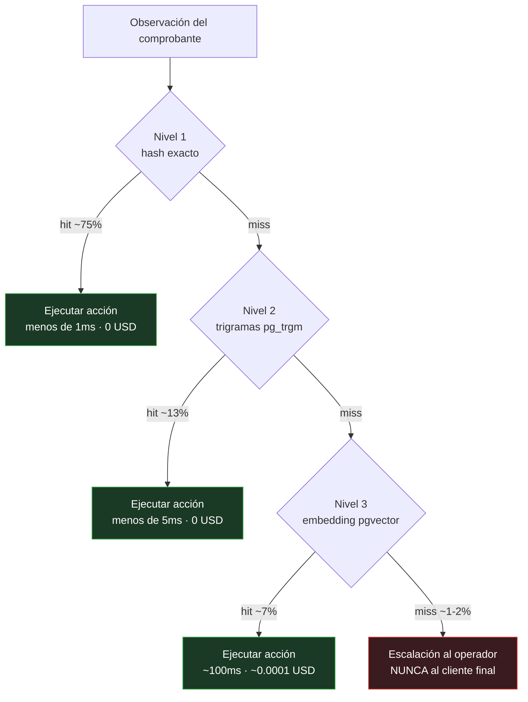
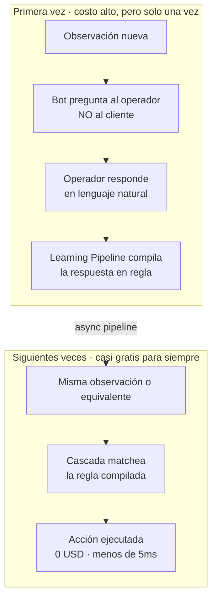

# Compiled Intelligence

**Submission de [@Agusting22](https://github.com/Agusting22) — Workshop Challenge Galo · Second Brain**

Un sistema de memoria que **compila** las respuestas del operador en reglas ejecutables determinísticas, en vez de almacenarlas como texto para que un LLM las interprete cada vez.

> 👉 **Mirá el demo interactivo:** abrí [`demo.html`](./demo.html) en tu browser (doble click, sin instalar nada). Cargá un comprobante de ejemplo, ves la cascada animada, la regla que matcheó, el costo y la acción que se transmite al ERP downstream.

---

## Cómo funciona el sistema, en simple

> Misma explicación que aparece en el panel **📖 ¿Cómo funciona?** del demo. Pensada para que la entienda cualquier persona, no solo alguien técnico.

### 1. ¿Qué problema resuelve?

**En una línea:** llegan miles de comprobantes por día con notas ambiguas. El bot tiene que aprender qué significan **sin volver a preguntar lo mismo** — ni al usuario interno ni, sobre todo, al cliente recurrente.

Galo procesa miles de comprobantes por día. La parte mecánica (extraer monto, CUIT, banco de la imagen) ya está resuelta. El problema son las **observaciones libres** tipo *«armar factura A y B»* o *«hacer 50/50»* — donde el bot necesita interpretar qué quiere el cliente.

Lo crítico: el cliente **ya envió esta misma nota la semana pasada**. Si la rueda de preguntas vuelve a empezar cada lunes, el cliente se cansa. Necesitamos memoria — pero una que sea barata, rápida y escale a millones de comprobantes.

> **Por qué decidimos esto:** el cliente recurrente es la cara comercial de Galo, no un objetivo de QA. Cada repregunta innecesaria es un costo de relación, no solo de operaciones.

### 2. La idea: compilar, no interpretar

**En una línea:** en vez de guardar las aclaraciones como texto para que la IA las relea cada vez, las **traducimos a reglas determinísticas** que se ejecutan sin IA.

Pensalo como la diferencia entre **un intérprete y un compilador**:

| | RAG clásico (intérprete) | Compiled Intelligence |
|---|---|---|
| Qué guarda | texto | reglas estructuradas (trigger → acción) |
| Cada query | usa IA | usa solo Postgres (en el 95% de los casos) |
| Determinismo | no garantizado | sí, mismo input = mismo output |
| Costo a 90 días | crece lineal con el uso | tiende a cero a medida que aprende |
| Latencia típica | 500ms – 2s | menos de 5ms |
| Si la API de IA cae | todo el sistema cae | el 95% sigue funcionando |

> **Por qué decidimos esto:** RAG resuelve el problema pero re-paga el costo de pensar en cada query. Si el conocimiento es estable (mismo cliente, misma nota), tiene más sentido pensar una vez, compilar el resultado, y ejecutarlo siempre.

### 3. Los 3 niveles, en simple

**En una línea:** el sistema busca la respuesta en orden, de más barato a más caro. Se corta apenas encuentra match.

Cada comprobante con observación ambigua pasa por una cascada de 3 niveles. Está ordenada para que **el caso común sea casi gratis** y el caso raro sea caro pero infrecuente:

| Nivel | % a día 90 | Latencia | Costo | Qué captura |
|------|------------|----------|-------|-------------|
| **1. Exact** (hash) | ~75% | <1ms | USD 0 | misma frase exacta |
| **2. Fuzzy** (trigramas) | ~13% | <5ms | USD 0 | typos, variaciones tipográficas |
| **3. Semantic** (embeddings) | ~7% | ~100ms | USD 0.0001 | sinónimos, otras palabras misma intención |
| **Escalación** (humano) | ~1-2% | tiempo humano | USD 0.003 + tiempo | observación genuinamente nueva |

- **Nivel 1 (Exact):** *¿esta frase la vi exactamente igual antes?* Es un lookup en una tabla. Sub-milisegundo.
- **Nivel 2 (Fuzzy):** *¿se parece a algo que vi, aunque tenga typos o variaciones?* Captura *«fact. A & B»* contra *«factura A y B»*.
- **Nivel 3 (Semantic):** *¿significa lo mismo que algo que vi, aunque use otras palabras?* Captura *«dividir en dos partes iguales»* contra *«50/50»*.
- **Escalación:** si nada matcheó, el bot le pregunta al **operador interno** (NUNCA al cliente final). El operador responde una vez y el Learning Pipeline compila la respuesta en regla — nunca más hace falta preguntar.

> **Por qué decidimos esto:** cada nivel cubre un tipo distinto de variación lingüística. Cortar en el primer match minimiza el costo. Si exact resuelve, no pagamos fuzzy ni semantic.

### 4. Cómo aprende sin molestar al cliente

**En una línea:** cuando nada matchea, el bot pregunta al **operador interno**, no al cliente. La respuesta del operador se compila en regla y queda guardada para siempre.

> **Por qué decidimos esto:** el cliente recurrente es asset comercial; el operador interno es asset operacional. Está bien interrumpir al operador para enseñarle al sistema; no está bien interrumpir al cliente por cosas que el sistema ya debería saber.

### 5. Per-client vs global

**En una línea:** una misma frase puede significar cosas distintas para clientes distintos. El sistema mantiene reglas específicas por cliente **y** reglas universales — y siempre prefiere la específica.

Para el cliente ABC, *«50/50»* significa "factura A y B en partes iguales". Para el cliente XYZ, *«50/50»* significa "dividir el monto en dos comprobantes separados". Misma observación, distinta acción.

Si 3+ clientes diferentes tienen reglas per-client con el mismo trigger y la misma acción, el sistema la **promueve a global** automáticamente. Las reglas per-client se mantienen como overrides.

> **Por qué decidimos esto:** el default conservador es per-client. El peor caso de equivocarse así es redundancia (compilar la misma idea varias veces). El peor caso de equivocarse al revés sería aplicar la regla incorrecta a otro cliente. Conservar primero, generalizar con evidencia.

### 6. Decisiones clave

| Pregunta | Decisión | Por qué |
|----------|----------|---------|
| ¿Postgres o vector DB dedicada (Pinecone, Weaviate)? | **Postgres + pg_trgm + pgvector** | Cubre relacional + texto + vectores en un solo sistema. USD 25/mes (Supabase Pro) alcanza para 10K clientes. Sin red extra ni dos sistemas que sincronizar. |
| ¿Qué LLM usamos? | **Haiku** | Las tareas que la IA hace son simples (clasificar binario, extraer JSON, resumir reglas). Haiku es 20-60x más barato que Sonnet/Opus y la latencia es menor. |
| ¿Le preguntamos al cliente final? | **Nunca** | El cliente es recurrente; la repregunta lo ofende. Toda escalación se resuelve internamente con el operador, una sola vez. |
| ¿Un solo nivel (todo semantic) o tres? | **Tres** | El 75%+ son repeticiones exactas a día 90. Pagar embedding cada vez es desperdicio sistemático cuando un B-tree lookup resuelve en <1ms gratis. |
| ¿Qué pasa si la API de IA cae? | **El 95% sigue funcionando** | Los 3 niveles son Postgres puro. Solo se degrada el aprendizaje y los casos nuevos. RAG, en cambio, detiene todo. |
| ¿Galo factura o hace logística? | **No** | Galo orquesta. La acción final es una **instrucción estructurada** transmitida al ERP de cada empresa contratante. Eso simplifica el alcance del sistema. |

---

## Cómo se evalúa contra los tres pilares

### Realismo
- **Stack estándar y barato**: Postgres + pgvector + pg_trgm. Supabase Pro a USD 25/mes alcanza para 10K clientes. Sin servicios exóticos.
- **Costo proyectado**: ~USD 35/mes a régimen para 100 clientes; ~USD 250/mes para 100K clientes (escala sublinealmente porque el LLM se usa menos a medida que hay más reglas).
- **Tolerancia a fallos**: si la API del LLM cae, el ~95% del sistema sigue operando con reglas determinísticas. Sólo se degrada el aprendizaje y los casos nuevos.
- **Auditabilidad**: cada acción ejecutada tiene una regla trazable con origen (qué interacción la creó), historial de uso y confianza. Crítico para una distribuidora que delega facturación a terceros.

### Creatividad
- **No es RAG.** No guardamos texto para reinterpretar — compilamos texto en código ejecutable.
- **Curva de costo invertida**: a más uso, más barato por unidad. El LLM se usa para enseñar al sistema, no para operarlo.
- **Doble dimensión client/global resuelta con un `ORDER BY` simple**: per-client wins, global como fallback. Promoción automática de per-client a global cuando 3+ clientes coinciden.
- **Cascada de 3 niveles ordenada por costo creciente**: exact (hash) → fuzzy (trigramas pg_trgm) → semantic (embeddings pgvector). Cada nivel cubre un tipo distinto de variación (tipográfica, semántica) sin pagar el costo del siguiente.

### Escalabilidad
- **Postgres maneja millones de reglas** con índices apropiados: B-tree para hash, GIN para trigramas, IVFFlat para vectores. Particionable por CUIT si crece más de 10M de filas.
- **El % de LLM decrece con el tiempo**: más reglas compiladas = más matches determinísticos. El componente caro se usa cada vez menos.
- **Asincronía**: el Learning Pipeline corre en background. El flujo principal nunca espera al LLM si no hace falta.
- **Client DNA acotado**: cada cliente tiene un resumen de ~200-500 tokens (no un log creciente), recompilado on-change.

---

## Qué hay en esta carpeta

| Archivo | Qué es |
|---------|--------|
| [**`demo.html`**](./demo.html) | **Demo interactivo.** Vanilla JS, single file, sin build. Abrilo en cualquier browser y proba la cascada con comprobantes de ejemplo. La lógica de matching, similitud de trigramas y mock semántico está toda en JS sobre datos en memoria. |
| [`ARCHITECTURE.md`](./ARCHITECTURE.md) | El documento completo. Decisiones, trade-offs, flujo end-to-end, edge cases, costos a escala, por qué no es RAG. Con diagramas Mermaid embebidos. |
| [`schema.sql`](./schema.sql) | Schema Postgres real con `pg_trgm` + `pgvector`. Tablas, índices, funciones de matching. Ejecutable tal cual sobre un Postgres con las extensiones habilitadas. |
| [`types.ts`](./types.ts) | Tipos compartidos: `Rule`, `ClientDNA`, `Action`, action_types. Referencia conceptual del modelo de datos. |
| [`flow.mmd`](./flow.mmd) | Diagrama Mermaid del flujo end-to-end (versión standalone, también embebido en ARCHITECTURE.md). |

---

## En una línea

> *"Si el conocimiento no cambia, no debería re-interpretarse. Compilalo una vez y ejecutalo siempre."*
