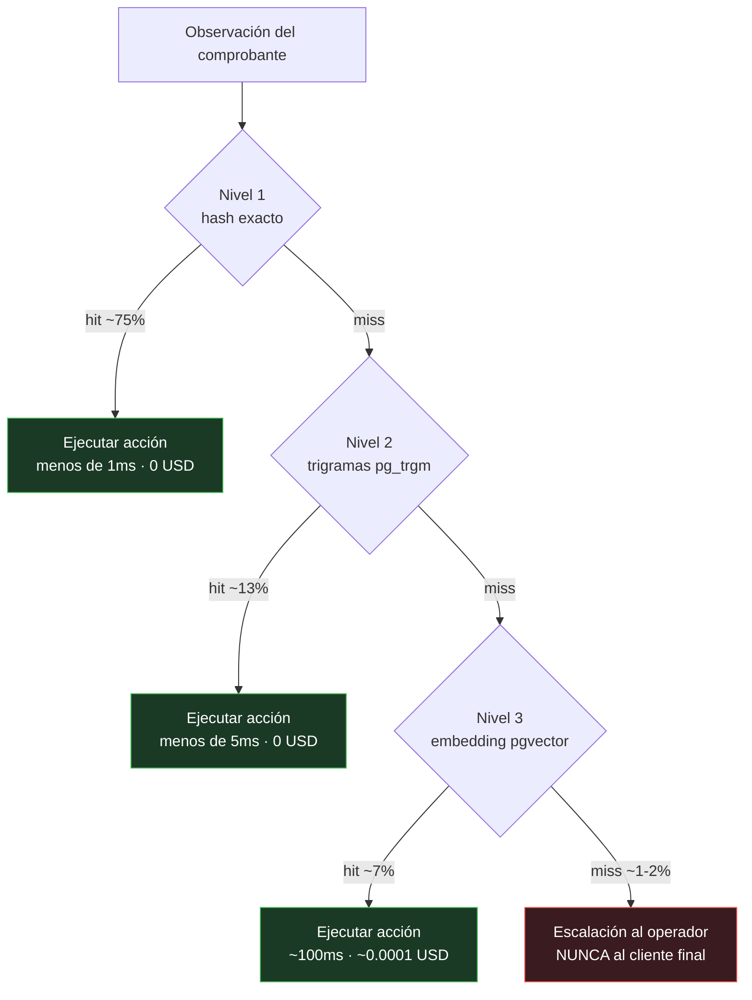
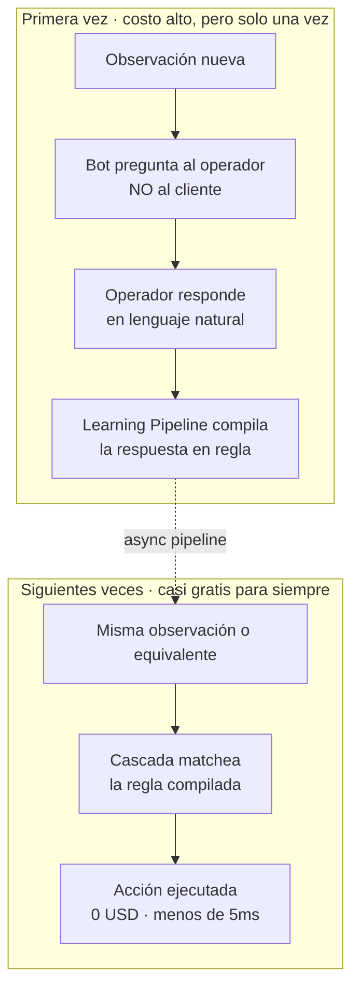

# Compiled Intelligence

**Submission de [@Agusting22](https://github.com/Agusting22) — Workshop Challenge Galo · Second Brain**

Un sistema de memoria que **compila** las respuestas del operador en reglas ejecutables determinísticas, en vez de almacenarlas como texto para que un LLM las interprete cada vez.

> 👉 **Mirá el demo interactivo:** abrí [`demo.html`](./demo.html) en tu browser (doble click, sin instalar nada). Cargá un comprobante de ejemplo, ves la cascada animada, la regla que matcheó, el costo y la acción que se transmite al ERP downstream. El propio demo tiene un panel **📖 ¿Cómo funciona?** que explica todo desde cero.

---

## Sobre la solución genérica vs. esta submission

> **Nota honesta del autor.** La arquitectura central que describe esta submission — *"extraer aclaraciones humanas del operador, compilarlas en reglas estructuradas, reusarlas con un matcher en cascada"* — es la respuesta razonable que cualquier IA moderna le da a este prompt. Es una buena respuesta. Pero si todos los participantes le piden a una IA que les resuelva el challenge, todos van a llegar más o menos al mismo lugar.

Por eso esta submission **suma tres diferenciales concretos sobre esa base** que difícilmente vengan de un prompt genérico, porque requieren leer el contexto específico de Galo (no solo el problema abstracto del challenge) y/o pensar en el sistema más allá del bucle obvio "pregunto → compilo → matcheo":

1. **Pre-compilación predictiva desde el historial de pedidos.** El sistema **no arranca vacío**. Un job background mina patrones del historial de pedidos que Galo ya tiene per-client y pre-popula reglas de baja confianza ANTES de que llegue el primer comprobante. Cuando ese primer comprobante llega, el sistema le propone al operador un match en un click en lugar de preguntarle "¿qué significa esto?". Esperable bootstrap del sistema: pasa de ~5-10% de cobertura Día 1 a **~30-45%**. Una IA genérica no razona sobre data lateral que la empresa ya tiene. → ver detalle en [ARCHITECTURE.md §11](./ARCHITECTURE.md#11-diferencial--pre-compilación-predictiva-desde-el-historial-de-pedidos).

2. **Aprendizaje negativo / reglas de frontera.** Cuando el operador corrige un match incorrecto, el sistema guarda **tanto la regla nueva como un contra-ejemplo de la regla vieja**. El matcher consulta esos contra-ejemplos antes de aceptar futuros matches: si una observación es más cercana a un contra-ejemplo que al trigger positivo, se rechaza el match. Las reglas aprenden explícitamente **sus límites**, no solo sus respuestas correctas. Cada corrección del operador aporta valor en dos dimensiones, no una. → ver detalle en [ARCHITECTURE.md §12](./ARCHITECTURE.md#12-diferencial--aprendizaje-negativo--reglas-de-frontera).

3. **Demo interactivo + drawer pedagógico, todo en un solo archivo HTML.** El evaluador no necesita instalar nada ni leer 500 líneas de doc para entender la propuesta. Abre [`demo.html`](./demo.html) con doble click, prueba la cascada con comprobantes mock, ve la animación de los niveles, lee la explicación adaptada para no-técnicos directamente desde el botón **📖 ¿Cómo funciona?**. La mayoría de submissions van a entregar solo documento.

La sección de abajo — **"Cómo funciona el sistema, en simple"** — explica los seis conceptos centrales con TL;DRs y diagramas. Las secciones **§11 y §12 del [ARCHITECTURE.md](./ARCHITECTURE.md)** desarrollan en detalle los dos diferenciales arquitectónicos, con diagramas Mermaid, esquema SQL y trade-offs.

---

## Cómo funciona el sistema, en simple

> Misma explicación que aparece en el panel **📖 ¿Cómo funciona?** del demo. Pensada para que la entienda cualquier persona, no solo alguien técnico.

### 1. ¿Qué problema resuelve?

**En una línea:** llegan miles de comprobantes por día con notas ambiguas. El bot tiene que aprender qué significan **sin volver a preguntar lo mismo** — ni al usuario interno ni, sobre todo, al cliente recurrente.

Galo procesa miles de comprobantes por día. La parte mecánica (extraer monto, CUIT, banco de la imagen) ya está resuelta. El problema son las **observaciones libres** tipo *«armar factura A y B»* o *«hacer 50/50»* — donde el bot necesita interpretar qué quiere el cliente.

Lo crítico: el cliente **ya envió esta misma nota la semana pasada**. Si la rueda de preguntas vuelve a empezar cada lunes, el cliente se cansa. Necesitamos memoria — pero una que sea barata, rápida y escale a millones de comprobantes.

> **Por qué decidimos esto:** el cliente recurrente es la cara comercial de Galo, no un objetivo de QA. Cada repregunta innecesaria es un costo de relación, no solo de operaciones.

### 2. La idea: compilar, no interpretar

**En una línea:** en vez de guardar las aclaraciones como texto para que la IA las relea cada vez, las **traducimos a reglas determinísticas** que se ejecutan sin IA.

Pensalo como la diferencia entre **un intérprete y un compilador**:

| | RAG clásico (intérprete) | Compiled Intelligence |
|---|---|---|
| Qué guarda | texto | reglas estructuradas (trigger → acción) |
| Cada query | usa IA | usa solo Postgres (en el 95% de los casos) |
| Determinismo | no garantizado | sí, mismo input = mismo output |
| Costo a 90 días | crece lineal con el uso | tiende a cero a medida que aprende |
| Latencia típica | 500ms – 2s | menos de 5ms |
| Si la API de IA cae | todo el sistema cae | el 95% sigue funcionando |

> **Por qué decidimos esto:** RAG resuelve el problema pero re-paga el costo de pensar en cada query. Si el conocimiento es estable (mismo cliente, misma nota), tiene más sentido pensar una vez, compilar el resultado, y ejecutarlo siempre.

### 3. Los 3 niveles, en simple

**En una línea:** el sistema busca la respuesta en orden, de más barato a más caro. Se corta apenas encuentra match.

Cada comprobante con observación ambigua pasa por una cascada de 3 niveles. Está ordenada para que **el caso común sea casi gratis** y el caso raro sea caro pero infrecuente:

| Nivel | % a día 90 | Latencia | Costo | Qué captura |
|------|------------|----------|-------|-------------|
| **1. Exacta** (hash) | ~75% | <1ms | USD 0 | misma frase exacta |
| **2. Aproximada** (trigramas) | ~13% | <5ms | USD 0 | typos, variaciones tipográficas |
| **3. Semántica** (embeddings) | ~7% | ~100ms | USD 0.0001 | sinónimos, otras palabras misma intención |
| **Escalación** (humano) | ~1-2% | tiempo humano | USD 0.003 + tiempo | observación genuinamente nueva |

- **Nivel 1 (Coincidencia exacta):** *¿esta frase la vi exactamente igual antes?* Es un lookup en una tabla. Sub-milisegundo.
- **Nivel 2 (Coincidencia aproximada):** *¿se parece a algo que vi, aunque tenga typos o variaciones?* Captura *«fact. A & B»* contra *«factura A y B»*.
- **Nivel 3 (Coincidencia semántica):** *¿significa lo mismo que algo que vi, aunque use otras palabras?* Captura *«dividir en dos partes iguales»* contra *«50/50»*.
- **Escalación:** si nada matcheó, el bot le pregunta al **operador interno** (NUNCA al cliente final). El operador responde una vez y el Learning Pipeline compila la respuesta en regla — nunca más hace falta preguntar.

> **Por qué decidimos esto:** cada nivel cubre un tipo distinto de variación lingüística. Cortar en el primer match minimiza el costo. Si la coincidencia exacta resuelve, no pagamos la aproximada ni la semántica.

### 4. Cómo aprende sin molestar al cliente

**En una línea:** cuando nada matchea, el bot pregunta al **operador interno**, no al cliente. La respuesta del operador se compila en regla y queda guardada para siempre.

> **Por qué decidimos esto:** el cliente recurrente es asset comercial; el operador interno es asset operacional. Está bien interrumpir al operador para enseñarle al sistema; no está bien interrumpir al cliente por cosas que el sistema ya debería saber.

### 5. Per-client vs global

**En una línea:** una misma frase puede significar cosas distintas para clientes distintos. El sistema mantiene reglas específicas por cliente **y** reglas universales — y siempre prefiere la específica.

Para el cliente ABC, *«50/50»* significa "factura A y B en partes iguales". Para el cliente XYZ, *«50/50»* significa "dividir el monto en dos comprobantes separados". Misma observación, distinta acción.

Si 3+ clientes diferentes tienen reglas per-client con el mismo trigger y la misma acción, el sistema la **promueve a global** automáticamente. Las reglas per-client se mantienen como overrides.

> **Por qué decidimos esto:** el default conservador es per-client. El peor caso de equivocarse así es redundancia (compilar la misma idea varias veces). El peor caso de equivocarse al revés sería aplicar la regla incorrecta a otro cliente. Conservar primero, generalizar con evidencia.

### 6. Decisiones clave

| Pregunta | Decisión | Por qué |
|----------|----------|---------|
| ¿Postgres o vector DB dedicada (Pinecone, Weaviate)? | **Postgres + pg_trgm + pgvector** | Cubre relacional + texto + vectores en un solo sistema. USD 25/mes (Supabase Pro) alcanza para 10K clientes. Sin red extra ni dos sistemas que sincronizar. |
| ¿Qué LLM usamos? | **Haiku** | Las tareas que la IA hace son simples (clasificar binario, extraer JSON, resumir reglas). Haiku es 20-60x más barato que Sonnet/Opus y la latencia es menor. |
| ¿Le preguntamos al cliente final? | **Nunca** | El cliente es recurrente; la repregunta lo ofende. Toda escalación se resuelve internamente con el operador, una sola vez. |
| ¿Un solo nivel (todo semántica) o tres? | **Tres** | El 75%+ son repeticiones exactas a día 90. Pagar embedding cada vez es desperdicio sistemático cuando un B-tree lookup resuelve en <1ms gratis. |
| ¿Qué pasa si la API de IA cae? | **El 95% sigue funcionando** | Los 3 niveles son Postgres puro. Solo se degrada el aprendizaje y los casos nuevos. RAG, en cambio, detiene todo. |
| ¿Galo factura o hace logística? | **No** | Galo orquesta. La acción final es una **instrucción estructurada** transmitida al ERP de cada empresa contratante. Eso simplifica el alcance del sistema. |

---

## Cómo se evalúa contra los tres pilares

### Realismo
- **Stack estándar y barato**: Postgres + pgvector + pg_trgm. Supabase Pro a USD 25/mes alcanza para 10K clientes. Sin servicios exóticos.
- **Costo proyectado**: ~USD 35/mes a régimen para 100 clientes; ~USD 250/mes para 100K clientes (escala sublinealmente porque el LLM se usa menos a medida que hay más reglas).
- **Tolerancia a fallos**: si la API del LLM cae, el ~95% del sistema sigue operando con reglas determinísticas. Sólo se degrada el aprendizaje y los casos nuevos.
- **Auditabilidad**: cada acción ejecutada tiene una regla trazable con origen (qué interacción la creó), historial de uso y confianza. Crítico para una distribuidora que delega facturación a terceros.

### Creatividad
- **No es RAG.** No guardamos texto para reinterpretar — compilamos texto en código ejecutable.
- **Curva de costo invertida**: a más uso, más barato por unidad. El LLM se usa para enseñar al sistema, no para operarlo.
- **Doble dimensión client/global resuelta con un `ORDER BY` simple**: per-client wins, global como fallback. Promoción automática de per-client a global cuando 3+ clientes coinciden.
- **Cascada de 3 niveles ordenada por costo creciente**: exacta (hash) → aproximada (trigramas pg_trgm) → semántica (embeddings pgvector). Cada nivel cubre un tipo distinto de variación (tipográfica, semántica) sin pagar el costo del siguiente.

### Escalabilidad
- **Postgres maneja millones de reglas** con índices apropiados: B-tree para hash, GIN para trigramas, IVFFlat para vectores. Particionable por CUIT si crece más de 10M de filas.
- **El % de LLM decrece con el tiempo**: más reglas compiladas = más matches determinísticos. El componente caro se usa cada vez menos.
- **Asincronía**: el Learning Pipeline corre en background. El flujo principal nunca espera al LLM si no hace falta.
- **Client DNA acotado**: cada cliente tiene un resumen de ~200-500 tokens (no un log creciente), recompilado on-change.

---

## Qué hay en esta carpeta

| Archivo | Qué es |
|---------|--------|
| [**`demo.html`**](./demo.html) | **Demo interactivo.** Vanilla JS, single file, sin build. Abrilo en cualquier browser y proba la cascada con comprobantes de ejemplo. La lógica de matching, similitud de trigramas y mock semántico está toda en JS sobre datos en memoria. |
| [`ARCHITECTURE.md`](./ARCHITECTURE.md) | El documento completo. Decisiones, trade-offs, flujo end-to-end, edge cases, costos a escala, por qué no es RAG. Con diagramas Mermaid embebidos. |
| [`schema.sql`](./schema.sql) | Schema Postgres real con `pg_trgm` + `pgvector`. Tablas, índices, funciones de matching. Ejecutable tal cual sobre un Postgres con las extensiones habilitadas. |
| [`types.ts`](./types.ts) | Tipos compartidos: `Rule`, `ClientDNA`, `Action`, action_types. Referencia conceptual del modelo de datos. |
| [`flow.mmd`](./flow.mmd) | Diagrama Mermaid del flujo end-to-end (versión standalone, también embebido en ARCHITECTURE.md). |

---

## Preguntas anticipadas (FAQ)

> Compilación de preguntas que probablemente surjan al leer la propuesta. Respuestas basadas en el diseño descrito en este submission. Para el detalle de cualquiera, ver [`ARCHITECTURE.md`](./ARCHITECTURE.md) o el panel **📖 ¿Cómo funciona?** del demo.

### Escala y costos

**¿Cómo escala el sistema a millones de comprobantes?**

El cuello de botella es Postgres, y Postgres con los índices apropiados (B-tree para hashes, GIN para trigramas, IVFFlat para vectores) maneja millones de filas sin esfuerzo. A 1M de clientes con ~5 reglas promedio = ~5M filas, lookups en microsegundos. Si supera ~10M filas, particionamos por `client_cuit`. **El % de uso de LLM decrece con el tiempo** porque más reglas compiladas = más matches deterministas, así que la curva de costo es invertida (a más tráfico, más barato por unidad). Ver [§8 Escalabilidad técnica](./ARCHITECTURE.md#8-escalabilidad-técnica).

**¿Cuánto cuesta a régimen?**

A 100 clientes ~USD 35/mes. A 1K clientes ~USD 55/mes. A 100K clientes ~USD 250/mes. A 1M clientes ~USD 450/mes. Pasar de 100 a 1M (10.000× más volumen) solo multiplica el costo por ~13×. La mayor parte es Supabase (Postgres + pgvector); la API de LLM (Haiku) tiende a ser menor con el tiempo. Detalle y tabla en [§7 Costos a escala](./ARCHITECTURE.md#7-costos-a-escala).

**¿Qué pasa si la API de IA (Anthropic/OpenAI) se cae?**

El **95% del sistema sigue funcionando**. Los 3 niveles de la cascada (exacta, aproximada, semántica con embeddings precomputados) son Postgres puro, sin dependencia online del LLM. Solo se degradan dos cosas: (a) la inferencia con DNA para casos nuevos, y (b) la compilación de respuestas nuevas. La queue del Learning Pipeline acumula tareas pendientes y se procesan cuando vuelve la API. **En un RAG, en cambio, un outage del LLM detiene 100% del tráfico.**

---

### Funcionamiento concreto

**Caso real: cliente recurrente que siempre compra sillas negras, pero un día el comprobante dice "sillas con patas". ¿Cómo se resuelve el error sin molestar al cliente?**

Asumiendo que es una observación de facturación (no la descripción del producto, que la maneja el bot existente de Galo):

1. Llega el comprobante → Lookup de Client DNA por CUIT → el `quirks_digest` dice algo como *"siempre 50/50 entre dos razones sociales"*.
2. La cascada corre contra las reglas per-client + globales:
   - **Coincidencia exacta** del hash de "sillas con patas" → no hay regla con ese trigger. ❌
   - **Coincidencia aproximada** (trigramas) → no se parece a "sillas negras" lo suficiente. ❌
   - **Coincidencia semántica** (concept tags) → "patas" no mapea a concepts conocidos del cliente. ❌
3. **Inferencia con DNA**: el sistema le pasa a Haiku la observación + el digest del cliente y le pregunta *"¿qué acción inferís?"*. Si Haiku puede con confianza, ejecuta. Si no, pasa al paso 4.
4. **Escalación al operador interno** (NUNCA al cliente). El operador ve un panel con contexto del cliente y responde: *"misma división de siempre"* o lo que corresponda.
5. El **Learning Pipeline compila** esa respuesta como regla nueva (per-client para ese CUIT, trigger = "sillas con patas").
6. **Próxima vez** que aparezca esa observación o variación: exacta / aproximada / semántica la captura, sin operador, sin LLM, en <5ms. 

**El cliente envió un comprobante normal y recibió su confirmación. Nunca fue molestado**. El dialogue de aclaración fue 100% interno entre el bot y el operador.

**¿Y si después aparece "sillas con patas plásticas" y el sistema lo confunde con la regla nueva?**

Acá entra el **aprendizaje negativo (§12)**. El operador corrige el match incorrecto. El sistema, automáticamente:
- Guarda "sillas con patas plásticas" como **contra-ejemplo** de la regla "sillas con patas" (no la corrige, marca la frontera).
- Compila una regla nueva para "sillas con patas plásticas" con la acción correcta.

Próxima vez que el matcher considere matchear contra "sillas con patas", chequea los contra-ejemplos: si la observación nueva es más cercana a un contra-ejemplo que al trigger positivo, rechaza el match y baja a la siguiente nivel de cascada. **Cada corrección del operador entrega valor en dos dimensiones**: regla nueva + frontera de regla vieja.

**¿Y si el cliente cambia su patrón con el tiempo (antes pedía 50/50, ahora 60/40)?**

Cuando el operador corrige el match: la regla vieja se **desactiva** (soft delete, no se borra para mantener audit trail) y se compila una regla nueva con la acción correcta. El `quirks_digest` del Client DNA se recompila para reflejar el cambio. Próximos comprobantes matchean la regla actualizada. Ver [§6.4 Cambio de patrón del cliente](./ARCHITECTURE.md#64-cambio-de-patrón-del-cliente-en-el-tiempo).

---

### Por qué esta propuesta y no otra

**¿No es esto un rules engine clásico (tipo Drools) con un loop de aprendizaje?**

La similitud existe — un rules engine también matchea reglas y ejecuta acciones. Tres diferencias clave:

1. **Las reglas se compilan automáticamente desde lenguaje natural**, no las escribe un developer.
2. **La cascada de 3 niveles ordenada por costo** (exacta → aproximada → semántica) es atípica en rules engines clásicos; típicamente solo hacen coincidencia exacta. Captura variaciones lingüísticas sin pagar el costo del LLM.
3. **Los dos diferenciales (§11 pre-compilación predictiva, §12 aprendizaje negativo)** son orthogonales al patrón de rules engines y son lo que un prompt genérico no propondría.

Honestamente: el corazón es un rules engine + memory system. La novedad está en las extensiones específicas al dominio de Galo y en la cascada de costo creciente. La [nota honesta arriba](#sobre-la-solución-genérica-vs-esta-submission) lo reconoce abiertamente.

**¿Es solo RAG con otro nombre?**

No. RAG guarda texto y le pide al LLM que lo interprete en cada query. Compiled Intelligence guarda reglas estructuradas y las **ejecuta sin LLM** en el 95% de los casos. La diferencia es: RAG paga el costo de pensar cada vez; este sistema piensa una vez (al compilar) y ejecuta siempre (al matchear). Detalle completo en [§9 Por qué no es RAG](./ARCHITECTURE.md#9-por-qué-no-es-rag).

**¿Por qué Postgres y no una vector DB dedicada (Pinecone, Weaviate)?**

Postgres + pg_trgm + pgvector cubren todo en un solo sistema (relacional + texto + vectores). Una vector DB dedicada agrega red, latencia y operaciones extra sin beneficio claro hasta volúmenes que aún no tenemos. USD 25/mes de Supabase Pro alcanza para 10K clientes. Ver [ADR en §10](./ARCHITECTURE.md#10-decisiones-y-trade-offs).

**¿Por qué Haiku y no Sonnet u Opus?**

Las tareas que la IA hace son simples: clasificar binario (per-client vs global), extraer JSON con schema cerrado, resumir reglas en ~150 tokens. Sonnet/Opus serían over-engineering: 20-60× más caros, latencia mayor, sin beneficio medible. Si en algún path puntual hace falta más potencia, se sube solo ese path.

---

### Datos, errores y producción

**¿Qué pasa si el operador se equivoca al responder?**

Mitigaciones en capas:
- Las reglas recién compiladas arrancan con confidence baja → el sistema pide confirmación antes de ejecutar autónomamente.
- Cualquier corrección posterior desactiva la regla mala y compila una nueva (más el contra-ejemplo §12).
- Las reglas con muchas correcciones se marcan como "volátiles" y se priorizan para revisión humana.

**¿Qué pasa si Haiku misclasifica una regla per-client como global?**

Acá entra la **cuarentena de promoción global (§5 + §6.7)**: el sistema **no** auto-promueve a global cuando 3 clientes coinciden. Pasa por un estado intermedio `candidate_global` que **no se aplica autónomamente** a otros clientes — solo se le propone al operador como sugerencia cuando viene un comprobante relevante. Después de ~5 validaciones humanas, pasa a global activa. Esto evita el envenenamiento progresivo que vendría de una cadena de misclasificaciones.

**¿Cómo se borra el historial de un cliente que se va?**

Soft delete con audit trail. Las reglas y el Client DNA se marcan `active = false`, no se purgan inmediatamente — por compliance y por si vuelve. Un job de retención puede purgarlos definitivamente después de N meses si la política lo requiere.

**¿Cómo migran a producción desde este diseño?**

Camino sugerido:
1. **Semana 1-2:** levantar Postgres con `pg_trgm` + `pgvector` + el schema. Cargar Client DNA basado en lo que Galo ya tiene (CUITs + razones sociales + bancos). Correr el job de pre-compilación predictiva (§11) contra el historial de pedidos.
2. **Semana 3-4:** dual-write — el bot existente sigue funcionando, pero también consulta el Rules Engine en paralelo y compara. Sin impacto en producción.
3. **Semana 5+:** activar el Rules Engine como path principal con escalación al operador para casos sin match. Métricas: resolution_rate, % de correcciones, tiempo medio del operador por intervención.

---

## En una línea

> *"Si el conocimiento no cambia, no debería re-interpretarse. Compilalo una vez y ejecutalo siempre."*
