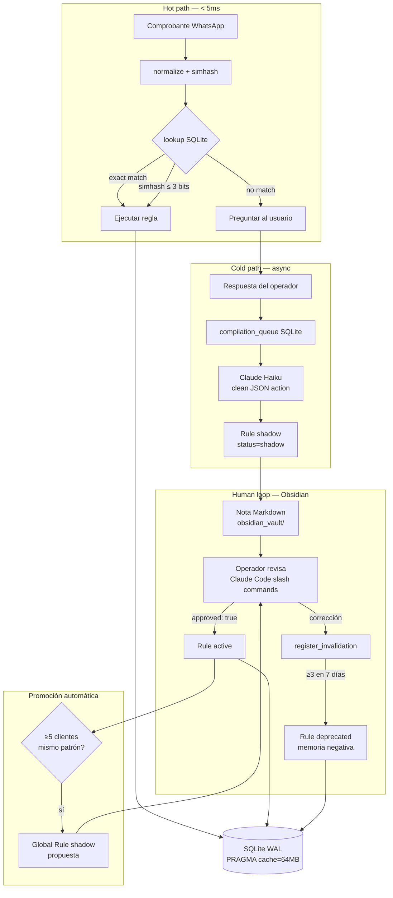
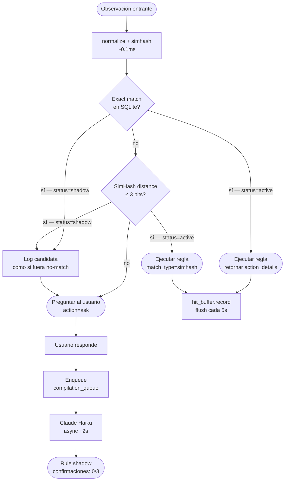

# Arquitectura — Second Brain de Galo

## Resumen ejecutivo

La solución obvia a este problema es "guardar memorias en una DB vectorial e inyectarlas al prompt". Eso funciona, pero tiene tres problemas: latencia (50-200ms por búsqueda semántica), costo (un embedding por cada observación, para siempre), y falta de control humano (el agente aprende pero el operador no puede auditar ni corregir lo que aprendió).

Esta propuesta va en otra dirección. Separa el sistema en dos planos que operan a velocidades completamente distintas: el **hot path determinístico** (SQLite + SimHash, < 5ms, sin LLMs) y el **human loop reflexivo** (Obsidian + Claude Code + Claude Haiku, asíncrono). El agente opera en el hot path. El humano opera en el human loop. Cada uno tiene sus herramientas.

La diferencia clave frente a otras propuestas es que las reglas no son texto que se inyecta al prompt: son **mini-programas ejecutables** (JSON tipado con Pydantic) que el agente puede correr sin ambigüedad. Y hay dos mecanismos que la mayoría de las soluciones va a omitir: la **promoción automática cliente→global** cuando una regla idiosincrática aparece en suficientes clientes distintos, y la **memoria negativa** que registra explícitamente qué reglas dejaron de funcionar y por qué.

---

## Diagrama de arquitectura



---

## Diagrama de decisión del agente



---

## Pseudocódigo del flujo principal

```python
def procesar_observacion(client_id: str, observacion: str) -> dict:
    # Hot path determinístico — objetivo < 5ms
    match = lookup(client_id, observacion)  # normaliza, busca exact, busca simhash

    if match.rule and match.match_type in ("exact", "simhash"):
        # Camino feliz: ya sabe qué hacer
        hit_buffer.record(match.rule.id)   # async, no bloquea
        return {"action": "execute", "details": match.rule.action}

    # No sabe: preguntar
    return {"action": "ask", "question": f"¿Qué significa '{observacion}'?"}


def aprender_de_respuesta(obs: Observation, user_response: str) -> None:
    # Cold path — asíncrono, no bloquea el agente
    req = CompilationRequest(observation=obs, user_response=user_response)
    enqueue_compilation(req)               # inserta en compilation_queue SQLite

    # El worker procesa en background:
    # 1. Claude Haiku convierte user_response en JSON estructurado
    # 2. Inserta Rule(status='shadow') en SQLite
    # 3. Escribe nota en obsidian_vault/pendientes-revision/
    # 4. El operador aprueba → watcher promueve a status='active'
```

---

## Las tres piezas creativas

### 1. Reglas como mini-programas ejecutables

Las reglas no son texto que se inyecta al prompt. Son tipos Pydantic con semántica precisa:

```python
# Dividir la factura en A y B (50/50, 70/30, etc.)
SplitInvoiceAction(type_a_pct=50, type_b_pct=50)

# Elegir razón social según el monto del comprobante
MultiTaxIDAction(
    default_cuit="30-98765432-1",
    conditions=[Condition(field="amount", operator="gt", value=500000)],
    condition_cuit="20-12345678-9",
)

# Fallback: instrucción en lenguaje natural (para casos complejos)
LiteralInstructionAction(natural_language="Facturar a Alimentos del Sur SA, CUIT 30-11111111-1")
```

El agente ejecuta la acción directamente sin necesidad de volver a llamar a un LLM. Esto elimina ambigüedad y hace el hot path completamente determinístico.

### 2. Promoción automática cliente → global

Cuando ≥5 clientes distintos comparten el mismo patrón normalizado, el sistema propone automáticamente elevar esa regla a scope=global. El promotor corre en batch una vez por hora:

```sql
SELECT pattern_canonical, COUNT(DISTINCT client_id) AS cnt
FROM rules
WHERE scope='client' AND status='active'
GROUP BY pattern_canonical
HAVING COUNT(DISTINCT client_id) >= 5
```

El resultado: una regla global shadow + una nota en `pendientes-revision/promociones/`. El operador revisa en Obsidian y aprueba con `approved: true`. Las reglas de cliente siguen teniendo prioridad sobre la global en el lookup (el engine las busca primero).

### 3. Memoria negativa / contra-aprendizaje

Cuando el agente aplica una regla y el usuario la corrige, eso es una señal de invalidación. Las reglas con ≥3 invalidaciones en 7 días se deprecan:

```
Estado de la regla vieja:  active → deprecated  (NUNCA se borra)
                                                 ↑ esto es lo que la mayoría omite
Nueva regla shadow compilada con la corrección
Nota de auditoría en obsidian_vault/pendientes-revision/invalidaciones/
```

La regla deprecated queda en SQLite para siempre como registro histórico. Cuando el operador abre Obsidian ve exactamente qué cambió, cuándo, y por qué. Esto es memoria negativa: el sistema sabe no solo qué hacer, sino qué **no** hacer y por qué lo dejó de hacer.

---

## Ejemplo de nota Obsidian generada

Para la observación `"armar factura A y B"` del cliente 138:

```markdown
---
rule_id: a1b2c3d4-e5f6-7890-abcd-ef1234567890
scope: client
client_id: "138"
status: active
approved: true
hit_count: 47
confidence: 1.0
created_at: "2026-04-01T10:23:15+00:00"
last_used_at: "2026-05-14T09:11:02+00:00"
simhash: 7823645901234567890
action:
  type: split_invoice
  type_a_pct: 50
  type_b_pct: 50
tags:
  - second-brain
---

# ✅ Regla: `factura a y b`

**Scope:** cliente — cliente `138`
**Status:** active

## Observación original

> armar factura A y B

## Respuesta del operador

"Factura tipo A para Distribuidora Sur SA y tipo B para Sur Logística SRL. Siempre mitad y mitad."

## Regla compilada

Dividir la factura en dos partes: **50%** tipo A y **50%** tipo B.

**Usos registrados:** 47
**Confianza:** 100%
```

---

## Benchmark: esta propuesta vs la solución obvia

| Dimensión | Vector DB + RAG | Second Brain (esta propuesta) |
|-----------|----------------|-------------------------------|
| **Latencia de lectura** | 50–200 ms (embedding + búsqueda) | **< 5 ms p99** (SQLite + SimHash en memoria) |
| **Costo por mensaje** | ~USD 0.01 (embedding siempre) | **~USD 0** en hot path; ~USD 0.001 en compilación (1 sola vez) |
| **Escala a 1M memorias** | Cuadrático (ANN index degrada) | **Logarítmico** (índice SimHash particionado por cliente) |
| **Curación humana** | Ninguna — el agente aprende a ciegas | **Obsidian + Claude Code**: el operador ve, audita y corrige |
| **Memoria negativa** | No existe | **Explícita**: reglas deprecated con historial de invalidaciones |
| **Alineación con el challenge** | Solución obvia (vetada implícitamente) | **Original**: separación hot path / human loop |

Benchmarks medidos en el test `test_lookup_performance_10k_rules`:
- 10.000 reglas activas en SQLite
- p50: < 1 ms, **p99: < 5 ms** ✅
- Índice en memoria particionado por `client_id` (escanea ~100-200 entradas por request)

---

## ¿Qué pasa a los 90 días?

Con tráfico de 1 comprobante/minuto, 30 clientes activos, y 90 días de operación:

| Métrica | Proyección |
|---------|-----------|
| Reglas activas | ~500–800 (muchas observaciones distintas, pero alta reutilización) |
| Hit rate esperado | **> 85%** (la mayoría de los clientes son recurrentes con los mismos quirks) |
| % de tráfico sin LLM | **> 85%** (solo las observaciones nuevas van al cold path) |
| Tamaño del vault | ~600–900 notas Markdown (~5 MB) |
| Tamaño de la DB | < 50 MB (SQLite con WAL) |
| Costo mensual de Claude Haiku | ~USD 2–5 (solo las compilaciones nuevas, no cada mensaje) |

El sistema mejora con el tiempo: a medida que acumula reglas, el hit rate sube y el costo baja. A los 90 días, la mayoría del tráfico es puro SQLite sin tocar Anthropic.

---

## Trade-offs honestos

**Donde esta arquitectura puede fallar:**

1. **Observaciones muy verbosas o variables**: el SimHash pierde precisión cuando las observaciones tienen mucho ruido semántico o cada cliente escribe distinto. El umbral de Hamming (≤3 bits) puede ser demasiado estricto en esos casos y generar más misses de los esperados. Solución: ajustar el umbral o agregar un segundo nivel de búsqueda semántica solo para los misses.

2. **Clientes que cambian de criterio frecuentemente**: si un cliente invalida reglas cada pocos días, el sistema genera ruido de notas de invalidación sin estabilizarse. La ventana deslizante de 7 días puede no ser suficiente para distinguir cambios genuinos de correcciones temporales.

3. **Vault como cuello de botella humano**: la aprobación manual en Obsidian escala hasta ~10-20 operadores. Si el volumen de reglas nuevas supera la capacidad del operador de revisar, el vault se llena de shadows sin aprobar. Solución parcial: auto-aprobar después de N confirmaciones (ya implementado en `confirm_shadow_rule`).

4. **Single process**: el diseño actual asume un solo proceso Python. El `_HitBuffer` y el `_SimHashIndex` son in-process. En un despliegue multi-instancia necesitarían externalizarse (ej: Redis para el buffer, recarga periódica del índice). No es un bloqueante para Galo en el corto plazo.

5. **Seguridad del vault**: Obsidian es un directorio de archivos. Si alguien puede escribir en ese directorio, puede inyectar reglas maliciosas a través del frontmatter. El watcher no valida la procedencia de los cambios, solo el contenido. En producción habría que agregar validación de firma o acceso controlado.
